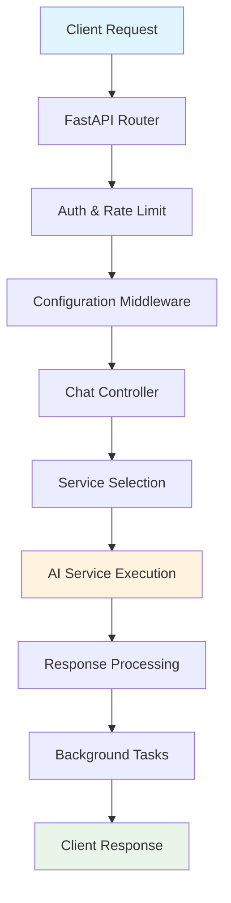
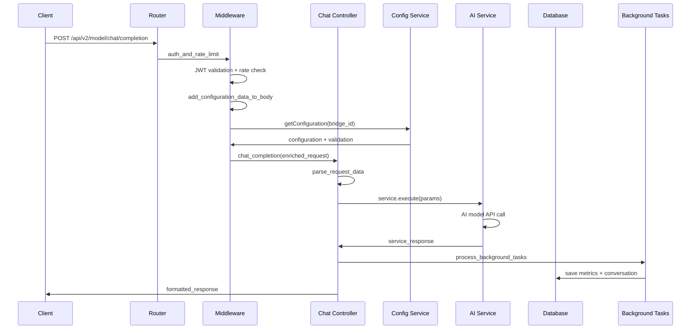

# AI Middleware - Chat Completion API Flow

## 📋 Overview
This document provides a **master overview** of the Chat Completion API flow from request initiation to response delivery. It serves as a navigation map for understanding the complete system architecture and cross-component interactions.

> **📚 Detailed Documentation**: For in-depth component details, see the [flows/](./flows/) and [components/](./components/) directories.

## 🏗️ System Architecture



## 🚀 Quick Start

### API Endpoint
```http
POST /api/v2/model/chat/completion
Content-Type: application/json
Authorization: Bearer <jwt_token>
```

### Entry Point Chain
```
index.py:167 → v2_router → modelRouter.py:chat_completion
```

**Middleware Stack:**
- 🔐 `auth_and_rate_limit` - JWT validation + rate limiting
- ⚙️ `add_configuration_data_to_body` - Configuration enrichment

> **📝 Details**: See [components/controllers/chat-completion-controller.md](./components/controllers/chat-completion-controller.md)

## 🔄 Complete Flow Overview

### End-to-End Flow Diagram



### 📋 Flow Steps Summary

| Step | Component | Purpose | Details |
|------|-----------|---------|----------|
| 1️⃣ | **Authentication** | Security & Rate Limiting | [middleware-flow.md](./flows/middleware-flow.md) |
| 2️⃣ | **Configuration** | Request Enrichment | [middleware-flow.md](./flows/middleware-flow.md) |
| 3️⃣ | **Chat Controller** | Request Processing | [service-layer-flow.md](./flows/service-layer-flow.md) |
| 4️⃣ | **Service Selection** | AI Provider Routing | [service-layer-flow.md](./flows/service-layer-flow.md) |
| 5️⃣ | **AI Execution** | Model API Calls | [service-layer-flow.md](./flows/service-layer-flow.md) |
| 6️⃣ | **Response Processing** | Format & Validate | [response-formatting-flow.md](./flows/response-formatting-flow.md) |
| 7️⃣ | **Background Tasks** | Metrics & Storage | [database-operations-flow.md](./flows/database-operations-flow.md) |

## 📊 Key Components Overview

### 🔐 Authentication & Security
- **JWT Middleware**: Token validation and user authentication
- **Rate Limiting**: 100 points per `bridge_id`, 20 points per `thread_id`
- **Organization Access Control**: Bridge-level permission validation

> **📝 Details**: [flows/middleware-flow.md](./flows/middleware-flow.md)

### ⚙️ Configuration Management
- **Configuration Service**: `src/services/utils/getConfiguration.py`
- **Redis Caching**: Bridge configurations cached by ID
- **Model Validation**: Service/model compatibility checks

> **📝 Details**: [components/services/configuration-service.md](./components/services/configuration-service.md)

**Supported AI Providers:**
- OpenAI (GPT models)
- Anthropic (Claude)
- Google (Gemini)
- Groq, Mistral, OpenRouter

**Service Selection Logic:**
- Dynamic service routing based on configuration
- Fallback model support for reliability
- Concurrent tool execution capabilities

> **📝 Details**: [components/services/ai-service-layer.md](./components/services/ai-service-layer.md)

### 💾 Database & Metrics
- **PostgreSQL**: Main data storage
- **TimescaleDB**: Time-series metrics
- **Redis**: Caching layer
- **MongoDB**: Configuration storage

> **📝 Details**: [flows/database-operations-flow.md](./flows/database-operations-flow.md)

## 📈 Performance Features

### ⚡ Optimization Strategies
- **Redis Caching**: Configuration and usage data
- **Connection Pooling**: Efficient database connections
- **Background Processing**: Non-blocking operations
- **Concurrent Execution**: Parallel tool calls

### 🔄 Reliability Features
- **Model Fallbacks**: Automatic alternative model execution
- **Retry Mechanisms**: Graceful failure handling
- **Error Recovery**: Comprehensive error management
- **Rate Limiting**: Request throttling protection

## 📝 Data Structures

### Request Format
```json
{
  "bridge_id": "string",
  "user": "string",
  "service": "openai",
  "model": "gpt-4",
  "thread_id": "string",
  "tools": [],
  "variables": {},
  "response_format": { "type": "default" }
}
```

### Response Format
```json
{
  "success": true,
  "output": [{
    "content": { "text": "AI response" },
    "usage": { "input_tokens": 100, "output_tokens": 50 }
  }]
}
```

> **📝 Details**: [components/controllers/data-structures.md](./components/controllers/data-structures.md)

## 🔗 Navigation Guide

### 📁 Detailed Flow Documentation
- **[middleware-flow.md](./flows/middleware-flow.md)** - Authentication, rate limiting, configuration
- **[service-layer-flow.md](./flows/service-layer-flow.md)** - AI service selection and execution
- **[response-formatting-flow.md](./flows/response-formatting-flow.md)** - Response processing and formatting
- **[database-operations-flow.md](./flows/database-operations-flow.md)** - Metrics collection and storage

### 📝 Component Documentation
- **[components/controllers/](./components/controllers/)** - API controllers and routing
- **[components/services/](./components/services/)** - Business logic and AI services
- **[components/middleware/](./components/middleware/)** - Request processing middleware

### 🔍 Quick References
- **Error Handling**: See [components/services/error-handling.md](./components/services/error-handling.md)
- **Security**: See [components/middleware/security.md](./components/middleware/security.md)
- **Performance**: See [flows/performance-optimization.md](./flows/performance-optimization.md)

---

**📚 For complete implementation details, navigate to the specific component documentation linked above.**
