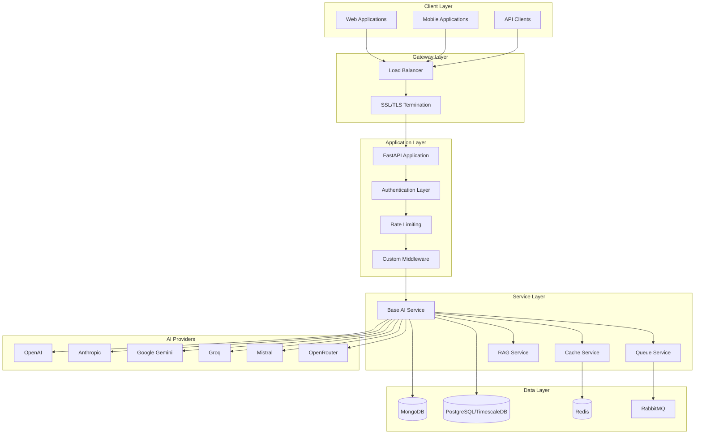

# AI Middleware System - Architectural Documentation

## Executive Summary

The AI Middleware System is a comprehensive FastAPI-based service that provides a unified interface for multiple AI service providers including OpenAI, Anthropic, Google Gemini, Groq, Mistral, and OpenRouter. The system acts as an intelligent proxy layer, offering features such as request routing, authentication, rate limiting, caching, queue management, and comprehensive monitoring.

## 🎯 Key Features

- **Multi-Provider AI Integration**: Unified API for 6+ AI service providers
- **Intelligent Request Routing**: Automatic failover and load balancing
- **Advanced Authentication**: JWT-based auth with multi-tier access control
- **Rate Limiting**: Granular rate limiting per user, thread, and organization
- **Caching Layer**: Redis-based response caching for improved performance  
- **Queue Management**: RabbitMQ-based asynchronous processing
- **Real-time Monitoring**: Comprehensive metrics and alerting via Atatus
- **Function Call Support**: Advanced tool calling and function execution
- **RAG Capabilities**: Retrieval-Augmented Generation for document processing
- **Multi-Database Architecture**: MongoDB, PostgreSQL/TimescaleDB, and Redis

## 📁 Documentation Structure

### Architecture Documentation
- **[System Architecture](architecture/system-architecture.md)** - High-level system overview and component diagrams
- **[Component Interactions](architecture/component-interactions.md)** - Detailed interaction flows and sequence diagrams  
- **[Deployment Infrastructure](architecture/deployment-infrastructure.md)** - Kubernetes deployment and infrastructure setup

### API Documentation  
- **[API Structure](api/api-structure.md)** - Complete API endpoint documentation and routing hierarchy

### Database Documentation
- **[Database Schema](database/database-schema.md)** - Multi-database schema design and relationships

## 🏗️ System Architecture Overview



## 🚀 Quick Start Guide

### Prerequisites
- Python 3.10+
- Docker and Docker Compose
- MongoDB 7.0+
- PostgreSQL with TimescaleDB extension
- Redis 7+
- RabbitMQ

### Development Setup
```bash
# Clone the repository
git clone <repository-url>
cd AI-middleware-python

# Install dependencies
pip install -r req.txt

# Set up environment variables
cp .env.example .env
# Edit .env with your configuration

# Start dependencies with Docker Compose
docker-compose -f docker-compose.dev.yml up -d

# Run the application
uvicorn index:app --reload --port 8080
```

### Production Deployment
```bash
# Build Docker image
docker build -t ai-middleware:latest .

# Deploy to Kubernetes
kubectl apply -f k8s/
```

## 🔧 Configuration Management

### Environment Variables
The system uses environment-based configuration with the following key categories:

- **Database Connections**: MongoDB, PostgreSQL, Redis URIs
- **AI Provider Keys**: API keys for all supported providers
- **Queue Configuration**: RabbitMQ connection and queue settings
- **Security Settings**: JWT secrets, encryption keys
- **Performance Tuning**: Worker counts, timeout settings
- **Monitoring**: Atatus configuration

### Dynamic Configuration
The system supports dynamic configuration updates through MongoDB change streams, allowing real-time configuration changes without service restart.

## 📊 Performance Characteristics

### Throughput
- **Peak Requests**: 10,000+ requests/minute
- **Concurrent Connections**: 1,000+ simultaneous connections
- **Average Response Time**: <500ms (cached), <2s (uncached)

### Scalability
- **Horizontal Scaling**: Kubernetes-based auto-scaling
- **Database Scaling**: Read replicas and connection pooling
- **Cache Scaling**: Redis cluster with automatic sharding

### Reliability
- **Uptime Target**: 99.9%
- **Failover Time**: <30 seconds
- **Data Durability**: Multi-zone replication

## 🔒 Security Framework

### Authentication & Authorization
- **JWT Tokens**: Stateless authentication with configurable expiration
- **API Keys**: Service-to-service authentication
- **Multi-Tier Access**: User, organization, and bridge-level permissions

### Data Protection
- **Encryption at Rest**: Database-level encryption
- **Encryption in Transit**: TLS 1.3 for all connections
- **Key Management**: Kubernetes secrets with rotation
- **PII Handling**: Data anonymization and retention policies

### Network Security
- **VPC Isolation**: Private network segments
- **Network Policies**: Kubernetes-based micro-segmentation
- **DDoS Protection**: Rate limiting and traffic analysis
- **Intrusion Detection**: Automated threat detection

## 📈 Monitoring & Observability

### Metrics Collection
- **Application Metrics**: Request rates, response times, error rates
- **Infrastructure Metrics**: CPU, memory, disk, network utilization  
- **Business Metrics**: AI provider usage, token consumption, costs
- **Custom Metrics**: Function call success rates, queue depths

### Logging Strategy
- **Structured Logging**: JSON-formatted logs with correlation IDs
- **Log Aggregation**: Centralized log collection with ELK stack
- **Log Retention**: Configurable retention periods by log level
- **Security Logging**: Authentication and authorization events

### Alerting Framework
- **Performance Alerts**: Response time degradation, error rate spikes
- **Infrastructure Alerts**: Resource utilization thresholds
- **Security Alerts**: Failed authentication attempts, anomalous behavior
- **Business Alerts**: Cost thresholds, quota utilization

## 🧪 Testing Strategy

### Unit Testing
- **Coverage Target**: >80% code coverage
- **Test Framework**: pytest with async support
- **Mock Strategy**: External API mocking for reliable tests

### Integration Testing
- **Database Testing**: Test database interactions with real instances
- **API Testing**: End-to-end API workflow testing
- **Queue Testing**: Message processing and error handling

### Performance Testing
- **Load Testing**: JMeter-based load testing scenarios
- **Stress Testing**: Breaking point identification
- **Endurance Testing**: Long-running stability testing

## 🔄 Development Workflow

### Code Standards
- **Linting**: flake8, black, isort for code formatting
- **Type Checking**: mypy for static type analysis
- **Documentation**: Docstring standards and API documentation

### CI/CD Pipeline
- **Continuous Integration**: Automated testing on pull requests
- **Continuous Deployment**: Automated deployment to staging/production
- **Quality Gates**: Code coverage, security scanning, performance testing

### Release Management
- **Semantic Versioning**: Version numbering strategy
- **Feature Flags**: Gradual feature rollout capability
- **Rollback Strategy**: Quick rollback procedures for production issues

## 📚 Additional Resources

### API Reference
- **OpenAPI Documentation**: Auto-generated API documentation
- **Postman Collection**: Ready-to-use API testing collection
- **SDK Documentation**: Client SDK usage examples

### Troubleshooting Guides
- **Common Issues**: Frequently encountered problems and solutions
- **Performance Tuning**: Optimization strategies and best practices
- **Debugging Guide**: Step-by-step debugging procedures

### Contributing Guidelines
- **Development Setup**: Local development environment setup
- **Code Contribution**: Pull request process and guidelines
- **Bug Reporting**: Issue reporting template and process

## 🤝 Support & Maintenance

### Support Channels
- **Documentation**: Comprehensive documentation and FAQs
- **Issue Tracking**: GitHub issues for bug reports and feature requests
- **Community**: Developer community and discussion forums

### Maintenance Schedule
- **Regular Updates**: Monthly dependency updates and security patches
- **Major Releases**: Quarterly feature releases with breaking changes
- **LTS Support**: Long-term support for stable versions

---

## Quick Navigation

| Section | Description | Link |
|---------|-------------|------|
| 🏗️ Architecture | System design and components | [View Details](architecture/system-architecture.md) |
| 🔄 Interactions | Component communication flows | [View Details](architecture/component-interactions.md) |
| 🚀 Deployment | Infrastructure and deployment | [View Details](architecture/deployment-infrastructure.md) |
| 📡 API | API endpoints and structure | [View Details](api/api-structure.md) |
| 🗄️ Database | Schema and relationships | [View Details](database/database-schema.md) |

---

*This documentation is maintained by the AI Middleware development team. For questions or contributions, please refer to our contributing guidelines.*