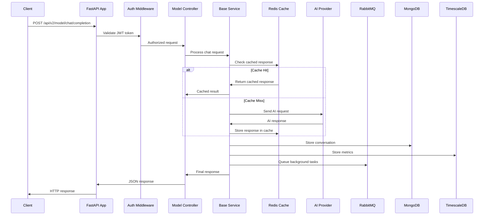
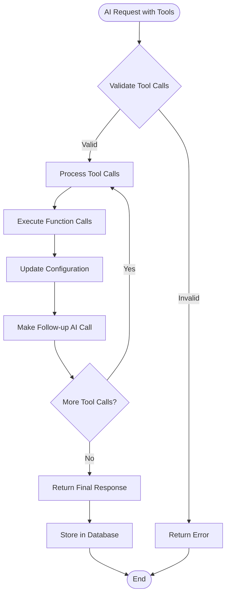
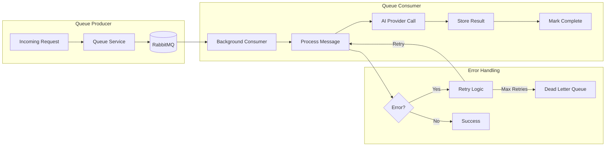
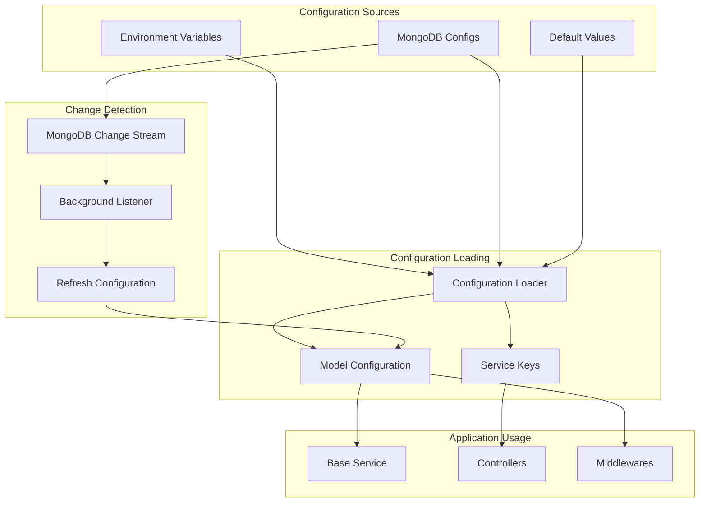
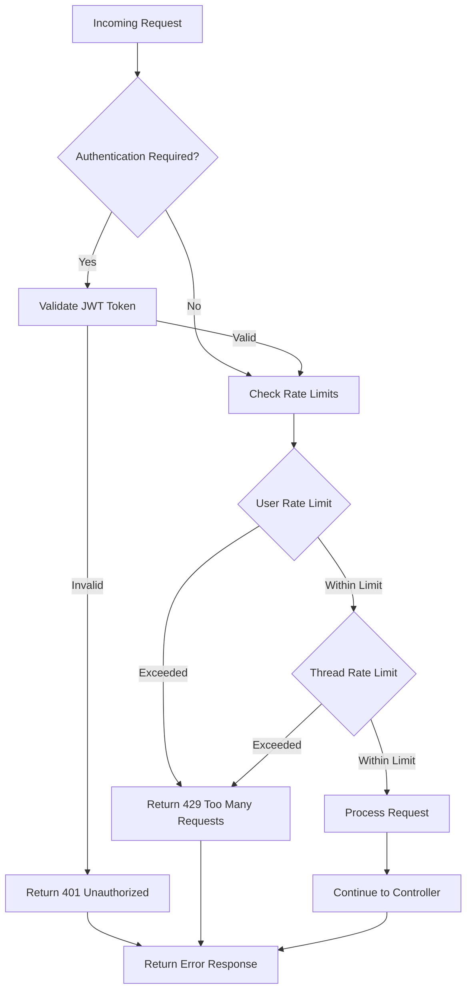
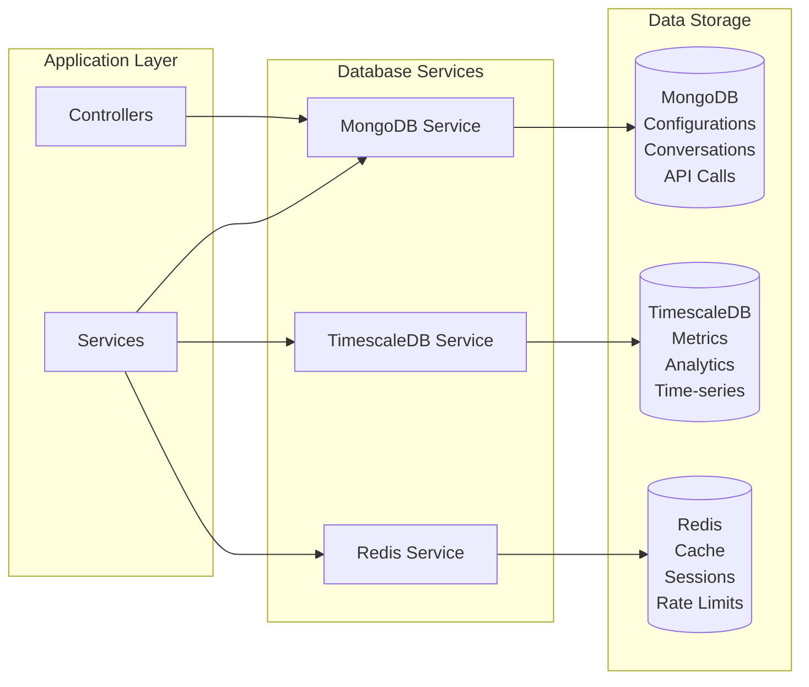
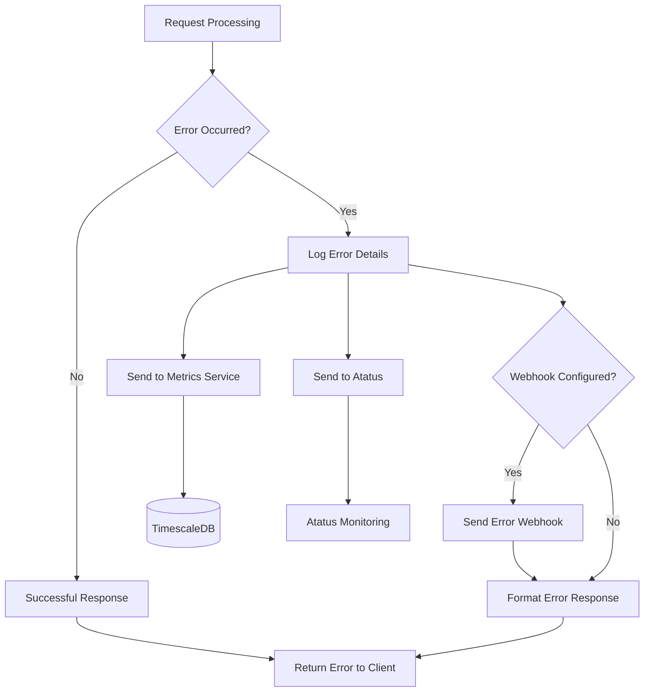
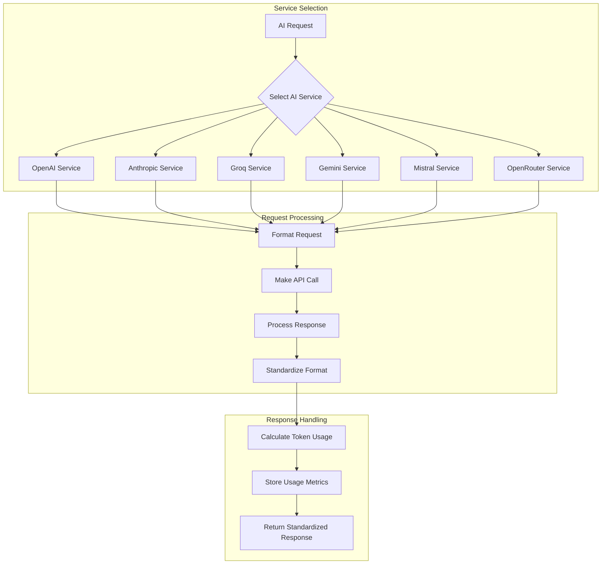

# Component Interaction Diagrams

## Detailed Component Interaction Flow

### 1. Chat Completion Request Flow

### 2. Function Call Processing Flow

### 3. Queue Processing Flow

### 4. Configuration Management Flow

### 5. Authentication & Rate Limiting Flow

### 6. Database Interaction Pattern

### 7. Error Handling & Monitoring Flow

### 8. AI Provider Abstraction Layer

## Key Integration Points

### 1. Service-to-Service Communication
- **Synchronous**: Direct function calls between services
- **Asynchronous**: RabbitMQ message queues for background tasks
- **Caching**: Redis for frequently accessed data

### 2. Data Persistence Patterns
- **MongoDB**: Document storage for configurations and conversations
- **TimescaleDB**: Time-series data for metrics and analytics
- **Redis**: Temporary storage for cache and session data

### 3. External API Integration
- **AI Providers**: RESTful API calls with retry logic
- **Webhooks**: Outbound notifications for events
- **Monitoring**: Atatus APM integration

### 4. Background Processing
- **Queue Workers**: Process messages asynchronously
- **Change Stream Listeners**: React to database changes
- **Scheduled Tasks**: Periodic maintenance operations

### 5. Error Propagation
- **Service Level**: Errors bubble up through service layers
- **Client Level**: Standardized error responses
- **Monitoring Level**: Error tracking and alerting

This interaction model ensures loose coupling between components while maintaining data consistency and providing comprehensive error handling and monitoring capabilities.