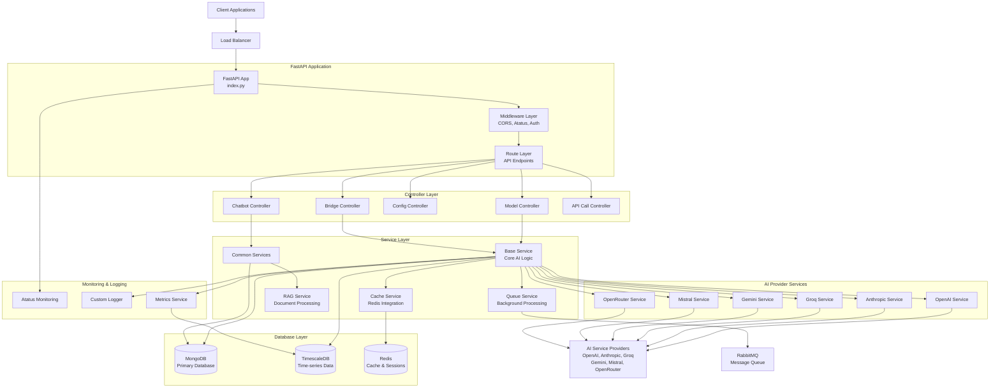

# AI Middleware System Architecture

## Overview

This AI middleware system is built with FastAPI and serves as a unified interface for multiple AI service providers. It provides features like request routing, authentication, rate limiting, caching, queue management, and comprehensive monitoring.

## High-Level System Architecture

## Component Details

### 1. FastAPI Application Layer
- **Entry Point**: [`index.py`](../../index.py)
- **Responsibilities**: 
  - Application lifecycle management
  - Middleware configuration
  - Route registration
  - Health checks
  - Background task initialization

### 2. Middleware Layer
- **Authentication**: JWT-based authentication
- **Rate Limiting**: Request throttling per user/endpoint
- **CORS**: Cross-origin resource sharing
- **Monitoring**: Atatus integration for APM

### 3. Controller Layer
- **Model Controller**: Handles AI model requests
- **Bridge Controller**: Manages bridge configurations
- **Config Controller**: Configuration management
- **Chatbot Controller**: Chatbot-specific operations

### 4. Service Layer
- **Base Service**: Core abstraction for AI provider interactions
- **Common Services**: Shared business logic
- **Queue Service**: Asynchronous task processing
- **Cache Service**: Redis-based caching
- **RAG Service**: Retrieval-Augmented Generation

### 5. AI Provider Integration
- **OpenAI**: GPT models and embeddings
- **Anthropic**: Claude models
- **Google Gemini**: Gemini models
- **Groq**: High-speed inference
- **Mistral**: Mistral models
- **OpenRouter**: Multi-provider routing

### 6. Database Systems
- **MongoDB**: Primary database for configurations, conversations, and metadata
- **TimescaleDB**: Time-series data for metrics and analytics
- **Redis**: Caching and session management

### 7. Message Queue System
- **RabbitMQ**: Asynchronous message processing
- **Background Tasks**: Long-running operations
- **Queue Management**: Load balancing and retry mechanisms

## Key Features

### Authentication & Authorization
- JWT token validation
- API key management
- Rate limiting per user/organization

### Multi-Provider Support
- Unified interface for multiple AI providers
- Automatic failover and load balancing
- Provider-specific optimizations

### Caching Strategy
- Redis-based response caching
- TTL-based cache invalidation
- Batch operation support

### Queue Processing
- Background task execution
- Message persistence
- Consumer scaling

### Monitoring & Observability
- Real-time performance monitoring
- Error tracking and alerting
- Comprehensive logging
- Metrics collection and analysis

### Configuration Management
- Dynamic configuration updates
- MongoDB change stream listeners
- Environment-based settings

## Data Flow Patterns

### Synchronous Request Flow
1. Client request → Load Balancer
2. FastAPI app → Middleware validation
3. Route → Controller → Service
4. AI Provider call → Response processing
5. Caching → Client response

### Asynchronous Processing Flow
1. Request → Queue Service
2. Background worker → Message processing
3. AI Provider interaction
4. Result storage → Notification

### Configuration Update Flow
1. MongoDB change detection
2. Change stream listener activation
3. Configuration refresh
4. Service reconfiguration

This architecture ensures scalability, reliability, and maintainability while providing a unified interface for multiple AI service providers.