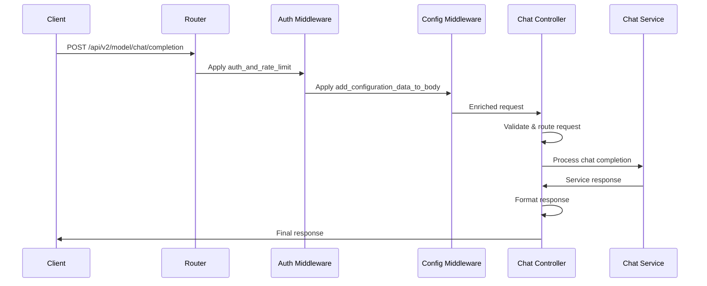

# Chat Completion Controller

## 📍 Controller Overview

### Route Definition
**File**: `src/routes/v2/modelRouter.py`
**Function**: `chat_completion`
**Endpoint**: `POST /api/v2/model/chat/completion`

## 🔗 Router Configuration

### FastAPI Router Setup
**File**: `index.py` (Line 167)

```python
from src.routes.v2.modelRouter import router as v2_router

app.include_router(
    v2_router, 
    prefix="/api/v2/model",
    tags=["AI Models v2"]
)
```

### Route Handler
```python
@router.post("/chat/completion")
async def chat_completion(
    request: Request,
    body: dict = Depends(auth_and_rate_limit),
    enriched_body: dict = Depends(add_configuration_data_to_body)
):
    """
    Handle chat completion requests with full middleware stack
    """
    return await process_chat_completion(enriched_body)
```

## 🛡️ Middleware Dependencies

### 1. Authentication & Rate Limiting
**Dependency**: `auth_and_rate_limit`
**File**: `src/middlewares/auth_and_rate_limit.py`

#### Functionality:
- JWT token validation
- User authentication and authorization
- Rate limiting enforcement (100 points per bridge_id, 20 per thread_id)
- Request context enrichment

#### Input/Output:
```python
# Input: Raw request with Authorization header
# Output: Authenticated request body with user context
{
    "user_id": "user_123",
    "org_id": "org_456", 
    "permissions": ["chat_completion"],
    "rate_limit_remaining": 95,
    "original_request": {...}
}
```

### 2. Configuration Data Enrichment
**Dependency**: `add_configuration_data_to_body`
**File**: `src/middlewares/getDataUsingBridgeId.py`

#### Functionality:
- Bridge configuration retrieval
- Model and service validation
- API key injection
- Tool and RAG data loading

#### Input/Output:
```python
# Input: Authenticated request body
# Output: Fully enriched request with configuration
{
    "bridge_id": "bridge_123",
    "configuration": {...},
    "service": "openai",
    "model": "gpt-4",
    "apikey": "sk-...",
    "tools": [...],
    "rag_data": [...],
    "variables": {...}
}
```

## 📝 Request Processing Flow

### Request Validation
```python
def validate_chat_request(request_body):
    """Validate incoming chat completion request"""
    
    required_fields = ["bridge_id", "user", "service", "model"]
    missing_fields = [field for field in required_fields 
                     if not request_body.get(field)]
    
    if missing_fields:
        raise ValidationError(f"Missing required fields: {missing_fields}")
    
    # Validate message content
    if not request_body.get("user") and not request_body.get("images"):
        raise ValidationError("Either 'user' message or 'images' must be provided")
    
    return True
```

### Request Data Structure
```python
class ChatCompletionRequest:
    """Standard chat completion request structure"""
    
    # Required fields
    bridge_id: str
    user: str  # User message content
    service: str  # AI service provider
    model: str  # Model name
    
    # Optional fields
    thread_id: Optional[str] = None
    sub_thread_id: Optional[str] = None
    variables: Dict[str, Any] = {}
    tools: List[Dict] = []
    response_format: Dict = {"type": "default"}
    temperature: Optional[float] = None
    max_tokens: Optional[int] = None
    files: List[str] = []
    images: List[str] = []
    is_playground: bool = False
    
    # Enriched by middleware
    configuration: Dict = {}
    apikey: str = ""
    org_id: str = ""
    rag_data: List[Dict] = []
```

## 🎯 Controller Logic

### Main Processing Function
```python
async def process_chat_completion(enriched_request):
    """Main chat completion processing logic"""
    
    try:
        # 1. Validate enriched request
        validate_enriched_request(enriched_request)
        
        # 2. Check response format routing
        response_format = enriched_request.get("response_format", {})
        
        if response_format.get("type") != "default":
            # Route to queue for async processing
            return await route_to_queue(enriched_request)
        
        # 3. Route based on request type
        request_type = enriched_request.get("type", "chat")
        
        if request_type == "embedding":
            return await handle_embedding_request(enriched_request)
        else:
            return await handle_chat_request(enriched_request)
            
    except Exception as e:
        return handle_controller_error(e, enriched_request)
```

### Queue Routing for Non-Default Responses
```python
async def route_to_queue(request_data):
    """Route non-default response formats to async queue"""
    
    queue_message = {
        "request_id": generate_request_id(),
        "request_data": request_data,
        "timestamp": datetime.utcnow().isoformat(),
        "priority": determine_priority(request_data)
    }
    
    # Publish to processing queue
    await publish_to_queue("chat_completion_queue", queue_message)
    
    return {
        "success": True,
        "message": "Request queued for processing",
        "request_id": queue_message["request_id"],
        "estimated_processing_time": "30-60 seconds"
    }
```

### Chat Request Handling
```python
async def handle_chat_request(request_data):
    """Handle standard chat completion requests"""
    
    # Import and call main chat function
    from src.services.commonServices.common import chat
    
    try:
        # Execute chat processing
        response = await chat(request_data)
        
        # Format response for client
        formatted_response = format_controller_response(response)
        
        return formatted_response
        
    except Exception as e:
        return handle_chat_error(e, request_data)
```

### Embedding Request Handling
```python
async def handle_embedding_request(request_data):
    """Handle text embedding requests"""
    
    from src.services.commonServices.embedding import embedding
    
    try:
        # Execute embedding processing
        response = await embedding(request_data)
        
        return format_embedding_response(response)
        
    except Exception as e:
        return handle_embedding_error(e, request_data)
```

## 📤 Response Formatting

### Standard Response Format
```python
def format_controller_response(service_response):
    """Format service response for API client"""
    
    if service_response.get("success"):
        return {
            "success": True,
            "output": service_response.get("output", []),
            "usage": service_response.get("usage", {}),
            "metadata": {
                "service": service_response.get("service"),
                "model": service_response.get("model"),
                "processing_time_ms": service_response.get("processing_time_ms"),
                "timestamp": datetime.utcnow().isoformat()
            }
        }
    else:
        return format_error_response(service_response)
```

### Error Response Handling
```python
def handle_controller_error(error, request_context):
    """Handle controller-level errors"""
    
    error_type = type(error).__name__
    
    error_mappings = {
        "ValidationError": {
            "status_code": 400,
            "error_code": "VALIDATION_ERROR"
        },
        "AuthenticationError": {
            "status_code": 401,
            "error_code": "AUTHENTICATION_ERROR"
        },
        "RateLimitError": {
            "status_code": 429,
            "error_code": "RATE_LIMIT_EXCEEDED"
        },
        "ServiceUnavailableError": {
            "status_code": 503,
            "error_code": "SERVICE_UNAVAILABLE"
        }
    }
    
    error_config = error_mappings.get(error_type, {
        "status_code": 500,
        "error_code": "INTERNAL_ERROR"
    })
    
    return {
        "success": False,
        "error": {
            "type": error_config["error_code"],
            "message": str(error),
            "timestamp": datetime.utcnow().isoformat()
        }
    }, error_config["status_code"]
```

## 📊 Request Analytics

### Request Tracking
```python
def track_request_analytics(request_data, response_data):
    """Track request analytics for monitoring"""
    
    analytics_event = {
        "event_type": "chat_completion_request",
        "bridge_id": request_data.get("bridge_id"),
        "org_id": request_data.get("org_id"),
        "service": request_data.get("service"),
        "model": request_data.get("model"),
        "request_size_bytes": len(json.dumps(request_data)),
        "response_size_bytes": len(json.dumps(response_data)),
        "success": response_data.get("success", False),
        "processing_time_ms": response_data.get("metadata", {}).get("processing_time_ms"),
        "timestamp": datetime.utcnow().isoformat()
    }
    
    # Send to analytics service
    send_analytics_event(analytics_event)
```

## 🔒 Security Considerations

### Input Sanitization
```python
def sanitize_request_input(request_data):
    """Sanitize user input to prevent injection attacks"""
    
    # Sanitize user message
    if "user" in request_data:
        request_data["user"] = sanitize_text(request_data["user"])
    
    # Sanitize variables
    if "variables" in request_data:
        for key, value in request_data["variables"].items():
            if isinstance(value, str):
                request_data["variables"][key] = sanitize_text(value)
    
    return request_data
```

### Rate Limiting Enforcement
```python
def enforce_additional_limits(request_data):
    """Enforce additional business logic limits"""
    
    # Check daily usage limits
    daily_usage = get_daily_usage(request_data["bridge_id"])
    daily_limit = get_bridge_daily_limit(request_data["bridge_id"])
    
    if daily_usage >= daily_limit:
        raise RateLimitError("Daily usage limit exceeded")
    
    # Check concurrent request limits
    concurrent_requests = get_concurrent_requests(request_data["bridge_id"])
    concurrent_limit = get_bridge_concurrent_limit(request_data["bridge_id"])
    
    if concurrent_requests >= concurrent_limit:
        raise RateLimitError("Concurrent request limit exceeded")
```

## 🔄 Controller Flow Summary



This controller provides a robust, secure, and well-structured entry point for chat completion requests with comprehensive middleware integration and error handling.
