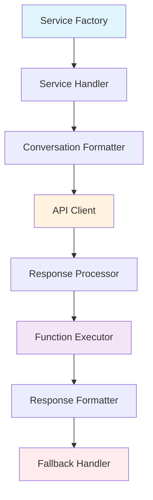

# AI Service Layer - Provider Integration & Management

## 🤖 Service Architecture Overview

The AI Service Layer provides a unified interface for multiple AI providers, handling service selection, conversation formatting, API calls, and response processing.

### Supported AI Providers
- **OpenAI**: GPT models, function calling, vision
- **Anthropic**: Claude models, tool use
- **Google**: Gemini models, multimodal capabilities
- **Groq**: Fast inference models
- **Mistral**: European AI models
- **OpenRouter**: Multi-provider routing

## 🏭 Service Factory Pattern

### Service Handler Creation
**File**: `src/services/utils/helper.py`
**Class**: `Helper`

```python
class Helper:
    """Service handler factory for AI providers"""
    
    @staticmethod
    def create_service_handler(service_name: str, **kwargs):
        """Create appropriate service handler based on service name"""
        
        service_mapping = {
            "openai": UnifiedOpenAICase,
            "openai_response": OpenaiResponse,
            "anthropic": Antrophic,
            "gemini": GeminiHandler,
            "groq": Groq,
            "mistral": Mistral,
            "open_router": OpenRouter
        }
        
        handler_class = service_mapping.get(service_name)
        if not handler_class:
            raise ValueError(f"Unsupported service: {service_name}")
        
        return handler_class(**kwargs)
```

## 🔄 Service Execution Flow

### Base Service Interface
**File**: `src/services/commonServices/baseService/baseService.py`

```python
class BaseService:
    """Base class for all AI service handlers"""
    
    def __init__(self, **params):
        self.params = params
        self.service = params.get("service")
        self.model = params.get("model")
        self.apikey = params.get("apikey")
    
    async def execute(self):
        """Main execution method - implemented by subclasses"""
        raise NotImplementedError
    
    async def chats(self):
        """Route to appropriate model runner based on service"""
        routing_map = {
            "openai": self.runModel,
            "openai_response": self.openai_response_model,
            "anthropic": self.anthropic_runmodel,
            "groq": self.groq_runmodel,
            "gemini": self.gemini_modelrun,
            "mistral": self.mistral_model_run,
            "open_router": self.openrouter_modelrun
        }
        
        runner = routing_map.get(self.service)
        if not runner:
            raise ValueError(f"No runner found for service: {self.service}")
        
        return await runner()
```

## 🎯 OpenAI Service Implementation

### OpenAI Handler
**File**: `src/services/commonServices/openAI/openaiCall.py`
**Class**: `UnifiedOpenAICase`

```python
class UnifiedOpenAICase(BaseService):
    """Unified OpenAI service handler"""
    
    async def execute(self):
        """Execute OpenAI chat completion"""
        try:
            # Create conversation format
            conversation = await self.create_conversation()
            
            # Execute API call
            response = await self.chats()
            
            # Process function calls if present
            if self.has_function_calls(response):
                response = await self.process_function_calls(response)
            
            # Format response
            formatted_response = self.format_response(response)
            
            return formatted_response
            
        except Exception as e:
            return self.handle_error(e)
    
    async def create_conversation(self):
        """Create OpenAI-formatted conversation"""
        from src.services.commonServices.createConversations import ConversationService
        
        return ConversationService.createOpenAiConversation(
            history=self.params.get("conversation", []),
            memory_context=self.params.get("memory", ""),
            tools=self.params.get("tools", [])
        )
```

### OpenAI Model Runner
**File**: `src/services/commonServices/openAI/runModel.py`

```python
async def runModel(params):
    """Execute OpenAI API call with retry logic"""
    
    client = AsyncOpenAI(api_key=params["apikey"])
    
    # Prepare API parameters
    api_params = {
        "model": params["model"],
        "messages": params["conversation"],
        "temperature": params.get("temperature", 0.7),
        "max_tokens": params.get("max_tokens"),
        "tools": params.get("tools"),
        "tool_choice": params.get("tool_choice", "auto")
    }
    
    # Remove None values
    api_params = {k: v for k, v in api_params.items() if v is not None}
    
    try:
        response = await client.chat.completions.create(**api_params)
        return process_openai_response(response)
        
    except openai.RateLimitError as e:
        return handle_rate_limit_error(e, params)
    except openai.APIError as e:
        return handle_api_error(e, params)
    except Exception as e:
        return handle_fallback_model(e, params)

def process_openai_response(response):
    """Process OpenAI API response"""
    
    message = response.choices[0].message
    
    # Extract content and function calls
    content = message.content or ""
    function_calls = []
    
    if message.tool_calls:
        for tool_call in message.tool_calls:
            function_calls.append({
                "id": tool_call.id,
                "name": tool_call.function.name,
                "arguments": json.loads(tool_call.function.arguments)
            })
    
    return {
        "success": True,
        "content": content,
        "function_calls": function_calls,
        "usage": {
            "input_tokens": response.usage.prompt_tokens,
            "output_tokens": response.usage.completion_tokens,
            "total_tokens": response.usage.total_tokens
        },
        "model": response.model
    }
```

## 🧠 Anthropic Service Implementation

### Anthropic Handler
**File**: `src/services/commonServices/anthropic/anthropicCall.py`

```python
class Antrophic(BaseService):
    """Anthropic Claude service handler"""
    
    async def execute(self):
        """Execute Anthropic chat completion"""
        try:
            # Create Anthropic conversation format
            conversation = await self.create_anthropic_conversation()
            
            # Execute API call
            response = await self.anthropic_runmodel()
            
            # Process tool use if present
            if self.has_tool_use(response):
                response = await self.process_tool_use(response)
            
            return self.format_response(response)
            
        except Exception as e:
            return self.handle_error(e)
    
    async def create_anthropic_conversation(self):
        """Create Anthropic-formatted conversation"""
        from src.services.commonServices.createConversations import ConversationService
        
        return ConversationService.createAnthropicConversation(
            history=self.params.get("conversation", []),
            system_prompt=self.params.get("configuration", {}).get("prompt", ""),
            tools=self.params.get("tools", [])
        )
```

## 🌟 Gemini Service Implementation

### Gemini Handler
**File**: `src/services/commonServices/gemini/geminiCall.py`

```python
class GeminiHandler(BaseService):
    """Google Gemini service handler"""
    
    async def execute(self):
        """Execute Gemini chat completion"""
        try:
            # Create Gemini conversation format
            conversation = await self.create_gemini_conversation()
            
            # Execute API call
            response = await self.gemini_modelrun()
            
            # Process function calling if present
            if self.has_function_calling(response):
                response = await self.process_function_calling(response)
            
            return self.format_response(response)
            
        except Exception as e:
            return self.handle_error(e)
    
    async def create_gemini_conversation(self):
        """Create Gemini-formatted conversation with parts structure"""
        from src.services.commonServices.createConversations import ConversationService
        
        return ConversationService.createGeminiConversation(
            history=self.params.get("conversation", []),
            system_instruction=self.params.get("configuration", {}).get("prompt", ""),
            tools=self.params.get("tools", [])
        )
```

## 🔧 Conversation Service

### Conversation Formatting
**File**: `src/services/commonServices/createConversations.py`

```python
class ConversationService:
    """Service for creating provider-specific conversation formats"""
    
    @staticmethod
    def createOpenAiConversation(history, memory_context="", tools=None):
        """Create OpenAI chat completion format"""
        
        messages = []
        
        # Add system message if present
        if memory_context:
            messages.append({
                "role": "system",
                "content": memory_context
            })
        
        # Process conversation history
        for item in history:
            if item.get("role") in ["user", "assistant", "system"]:
                message = {
                    "role": item["role"],
                    "content": item.get("content", "")
                }
                
                # Add tool calls if present
                if item.get("tool_calls"):
                    message["tool_calls"] = item["tool_calls"]
                
                messages.append(message)
        
        return messages
    
    @staticmethod
    def createAnthropicConversation(history, system_prompt="", tools=None):
        """Create Anthropic conversation format"""
        
        messages = []
        
        # Anthropic doesn't include system in messages array
        for item in history:
            if item.get("role") in ["user", "assistant"]:
                message = {
                    "role": item["role"],
                    "content": item.get("content", "")
                }
                
                # Add tool use if present
                if item.get("tool_use"):
                    message["content"] = [
                        {"type": "text", "text": item.get("content", "")},
                        {"type": "tool_use", **item["tool_use"]}
                    ]
                
                messages.append(message)
        
        return messages, system_prompt
    
    @staticmethod
    def createGeminiConversation(history, system_instruction="", tools=None):
        """Create Gemini conversation format with parts structure"""
        
        contents = []
        
        for item in history:
            role = "user" if item.get("role") == "user" else "model"
            
            parts = []
            
            # Add text content
            if item.get("content"):
                parts.append({"text": item["content"]})
            
            # Add function calls
            if item.get("function_calls"):
                for func_call in item["function_calls"]:
                    parts.append({
                        "functionCall": {
                            "name": func_call["name"],
                            "args": func_call["arguments"]
                        }
                    })
            
            # Add function responses
            if item.get("function_responses"):
                for func_resp in item["function_responses"]:
                    parts.append({
                        "functionResponse": {
                            "name": func_resp["name"],
                            "response": func_resp["response"]
                        }
                    })
            
            contents.append({
                "role": role,
                "parts": parts
            })
        
        return contents, system_instruction
```

## 🛠️ Function/Tool Processing

### Function Call Detection
**File**: `src/services/commonServices/openAI/openai_response.py`

```python
def detect_function_calls(response):
    """Enhanced function call detection across multiple formats"""
    
    output = response.get("output", [])
    if not output:
        return False
    
    # Check multiple detection strategies
    detection_methods = [
        check_tool_calls_format,
        check_function_call_format,
        check_embedded_function_calls,
        check_reasoning_function_calls
    ]
    
    for method in detection_methods:
        if method(output):
            return True
    
    return False

def check_tool_calls_format(output):
    """Check for tool_calls in response"""
    for item in output:
        if item.get("tool_calls"):
            return True
        if item.get("content", {}).get("tool_calls"):
            return True
    return False

def check_function_call_format(output):
    """Check for function_call in response"""
    for item in output:
        if item.get("function_call"):
            return True
        if item.get("content", {}).get("function_call"):
            return True
    return False
```

### Concurrent Tool Execution
**File**: `src/services/commonServices/baseService/baseService.py`

```python
async def execute_tools_concurrently(self, tool_calls):
    """Execute multiple tools concurrently"""
    
    tasks = []
    
    for tool_call in tool_calls:
        task = asyncio.create_task(
            self.execute_single_tool(tool_call)
        )
        tasks.append(task)
    
    # Execute all tools concurrently
    results = await asyncio.gather(*tasks, return_exceptions=True)
    
    # Process results and handle exceptions
    processed_results = []
    for i, result in enumerate(results):
        if isinstance(result, Exception):
            processed_results.append({
                "tool_call_id": tool_calls[i].get("id"),
                "success": False,
                "error": str(result),
                "result": None
            })
        else:
            processed_results.append({
                "tool_call_id": tool_calls[i].get("id"),
                "success": True,
                "error": None,
                "result": result
            })
    
    return processed_results

async def execute_single_tool(self, tool_call):
    """Execute a single tool/function call"""
    
    tool_name = tool_call.get("name")
    tool_args = tool_call.get("arguments", {})
    
    # Get tool configuration
    tool_config = self.get_tool_config(tool_name)
    
    if not tool_config:
        raise ValueError(f"Tool not found: {tool_name}")
    
    # Execute HTTP call to tool endpoint
    try:
        response = await self.make_tool_request(
            url=tool_config["url"],
            method=tool_config.get("method", "POST"),
            data=tool_args,
            headers=tool_config.get("headers", {}),
            timeout=tool_config.get("timeout", 30)
        )
        
        return response
        
    except Exception as e:
        raise Exception(f"Tool execution failed: {str(e)}")
```

## 📊 Response Processing & Formatting

### Response Standardization
**File**: `src/services/utils/ai_middleware_format.py`

```python
def format_ai_response(service_response, service_name):
    """Format service response to standard AI middleware format"""
    
    formatted_response = {
        "success": service_response.get("success", True),
        "output": [],
        "usage": extract_usage_metrics(service_response),
        "metadata": {
            "service": service_name,
            "model": service_response.get("model"),
            "processing_time_ms": service_response.get("latency_ms"),
            "timestamp": datetime.utcnow().isoformat()
        }
    }
    
    # Process output items
    for item in service_response.get("output", []):
        formatted_item = format_output_item(item, service_name)
        formatted_response["output"].append(formatted_item)
    
    return formatted_response

def extract_usage_metrics(response):
    """Extract and standardize usage metrics"""
    
    usage = response.get("usage", {})
    
    return {
        "input_tokens": usage.get("input_tokens", 0),
        "output_tokens": usage.get("output_tokens", 0),
        "total_tokens": usage.get("total_tokens", 0),
        "input_cost": usage.get("input_cost", 0.0),
        "output_cost": usage.get("output_cost", 0.0),
        "total_cost": usage.get("total_cost", 0.0)
    }
```

## 🔄 Fallback & Retry Logic

### Model Fallback Strategy
```python
FALLBACK_MODELS = {
    "gpt-4": ["gpt-4-turbo", "gpt-3.5-turbo"],
    "gpt-4-turbo": ["gpt-3.5-turbo"],
    "claude-3-opus": ["claude-3-sonnet", "claude-3-haiku"],
    "claude-3-sonnet": ["claude-3-haiku"],
    "gemini-pro": ["gemini-pro-vision"],
    "llama2-70b-4096": ["mixtral-8x7b-32768"]
}

async def handle_fallback_model(error, params):
    """Handle model fallback on failure"""
    
    current_model = params.get("model")
    fallback_models = FALLBACK_MODELS.get(current_model, [])
    
    for fallback_model in fallback_models:
        try:
            # Update params with fallback model
            fallback_params = params.copy()
            fallback_params["model"] = fallback_model
            
            # Retry with fallback model
            response = await execute_with_fallback_model(fallback_params)
            
            # Add fallback metadata
            response["fallback_used"] = True
            response["original_model"] = current_model
            response["fallback_model"] = fallback_model
            response["fallback_reason"] = str(error)
            
            return response
            
        except Exception as fallback_error:
            continue  # Try next fallback model
    
    # All fallbacks failed
    raise Exception(f"All models failed. Original error: {error}")
```

## 🔄 Service Layer Summary



This AI Service Layer provides a robust, extensible architecture for integrating multiple AI providers with consistent interfaces, comprehensive error handling, and advanced features like concurrent tool execution and intelligent fallback strategies.
