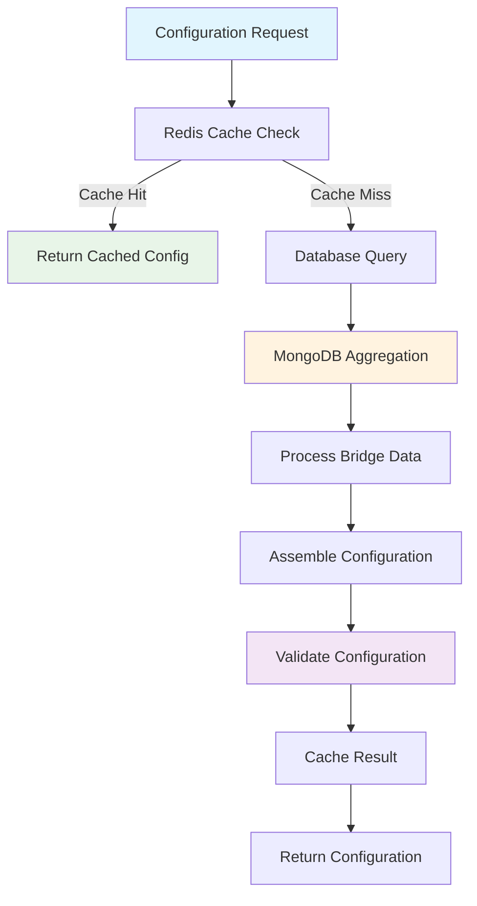

# Configuration Service - Bridge & Model Management

## 🔧 Configuration Architecture

The Configuration Service manages bridge configurations, model settings, API keys, and associated tools/RAG data. It provides caching, validation, and dynamic configuration assembly.

## 📋 Core Configuration Service

### Main Configuration Function
**File**: `src/services/utils/getConfiguration.py`
**Function**: `getConfiguration`

```python
async def getConfiguration(
    configuration: Dict,
    service: str,
    bridge_id: str,
    apikey: str = None,
    template_id: str = None,
    variables: Dict = None,
    org_id: str = None,
    variables_path: str = None,
    version_id: str = None,
    extra_tools: List = None,
    built_in_tools: List = None
):
    """
    Assemble complete configuration from bridge data and parameters
    
    Returns:
        Dict: Complete configuration with all necessary data
    """
    
    try:
        # Get bridge data from database
        bridge_data = await get_bridge_data(
            bridge_id=bridge_id,
            org_id=org_id,
            version_id=version_id
        )
        
        # Validate bridge data
        validate_bridge_configuration(bridge_data, service)
        
        # Assemble configuration
        assembled_config = assemble_configuration(
            base_config=configuration,
            bridge_data=bridge_data,
            service=service,
            variables=variables or {},
            extra_tools=extra_tools or [],
            built_in_tools=built_in_tools or []
        )
        
        return {
            "success": True,
            "configuration": assembled_config["configuration"],
            "service": service,
            "apikey": assembled_config["apikey"],
            "pre_tools": assembled_config.get("pre_tools"),
            "variables": assembled_config["variables"],
            "rag_data": assembled_config["rag_data"],
            "tools": assembled_config["tools"],
            "tool_id_and_name_mapping": assembled_config["tool_mapping"],
            "gpt_memory": assembled_config.get("gpt_memory", False),
            "version_id": version_id,
            "bridge_id": bridge_id
        }
        
    except Exception as e:
        return {
            "success": False,
            "error": str(e),
            "error_type": type(e).__name__
        }
```

## 🗄️ Bridge Data Retrieval

### Database Service
**File**: `src/db_services/ConfigurationServices.py`
**Function**: `get_bridges_with_tools_and_apikeys`

```python
async def get_bridges_with_tools_and_apikeys(bridge_id: str, org_id: str = None):
    """
    Retrieve bridge configuration with associated tools and API keys
    
    Uses MongoDB aggregation pipeline to join multiple collections
    """
    
    pipeline = [
        # Match bridge by ID
        {
            "$match": {
                "_id": ObjectId(bridge_id)
            }
        },
        
        # Join with tools/functions
        {
            "$lookup": {
                "from": "apicalls",
                "localField": "_id",
                "foreignField": "bridge_id",
                "as": "tools"
            }
        },
        
        # Join with API keys
        {
            "$lookup": {
                "from": "apikeycredentials",
                "localField": "org_id",
                "foreignField": "org_id",
                "as": "apikeys"
            }
        },
        
        # Join with RAG documents
        {
            "$lookup": {
                "from": "rag_parent_datas",
                "localField": "_id",
                "foreignField": "bridge_id",
                "as": "rag_data"
            }
        },
        
        # Project required fields
        {
            "$project": {
                "bridge_id": {"$toString": "$_id"},
                "org_id": 1,
                "name": 1,
                "configuration": 1,
                "tools": 1,
                "apikeys": 1,
                "rag_data": 1,
                "settings": 1,
                "created_at": 1,
                "updated_at": 1
            }
        }
    ]
    
    result = await mongodb_collection.aggregate(pipeline).to_list(1)
    
    if not result:
        raise ValueError(f"Bridge not found: {bridge_id}")
    
    return result[0]
```

### Bridge Data Utilities
**File**: `src/services/utils/getConfiguration_utils.py`

```python
async def get_bridge_data(bridge_id: str, org_id: str = None, version_id: str = None):
    """
    Get bridge data with Redis caching
    """
    
    # Check Redis cache first
    cache_key = f"bridge_config:{bridge_id}:{version_id or 'latest'}"
    cached_data = await redis_client.get(cache_key)
    
    if cached_data:
        return json.loads(cached_data)
    
    # Fetch from database
    bridge_data = await ConfigurationServices.get_bridges_with_tools_and_apikeys(
        bridge_id=bridge_id,
        org_id=org_id
    )
    
    # Process and clean data
    processed_data = process_bridge_data(bridge_data)
    
    # Cache for 1 hour
    await redis_client.setex(
        cache_key,
        3600,
        json.dumps(processed_data, default=str)
    )
    
    return processed_data

def process_bridge_data(raw_data):
    """Process raw bridge data for use"""
    
    # Convert ObjectIds to strings
    processed_data = convert_objectids_to_strings(raw_data)
    
    # Organize tools by type
    processed_data["tools"] = organize_tools(processed_data.get("tools", []))
    
    # Process API keys by service
    processed_data["apikeys"] = organize_apikeys(processed_data.get("apikeys", []))
    
    # Process RAG data
    processed_data["rag_data"] = process_rag_data(processed_data.get("rag_data", []))
    
    return processed_data
```

## ⚙️ Configuration Assembly

### Configuration Builder
```python
def assemble_configuration(
    base_config: Dict,
    bridge_data: Dict,
    service: str,
    variables: Dict,
    extra_tools: List,
    built_in_tools: List
):
    """
    Assemble complete configuration from all sources
    """
    
    # Start with bridge configuration
    assembled_config = bridge_data.get("configuration", {}).copy()
    
    # Merge with base configuration (base takes precedence)
    assembled_config.update(base_config)
    
    # Process variables
    processed_variables = process_variables(
        variables=variables,
        bridge_variables=bridge_data.get("variables", {}),
        configuration=assembled_config
    )
    
    # Assemble tools
    all_tools = assemble_tools(
        bridge_tools=bridge_data.get("tools", []),
        extra_tools=extra_tools,
        built_in_tools=built_in_tools
    )
    
    # Get API key for service
    service_apikey = get_service_apikey(
        bridge_apikeys=bridge_data.get("apikeys", {}),
        service=service
    )
    
    # Process RAG data
    processed_rag_data = process_rag_documents(
        bridge_data.get("rag_data", [])
    )
    
    return {
        "configuration": assembled_config,
        "apikey": service_apikey,
        "variables": processed_variables,
        "tools": all_tools["tools"],
        "tool_mapping": all_tools["mapping"],
        "rag_data": processed_rag_data,
        "pre_tools": bridge_data.get("pre_tools"),
        "gpt_memory": bridge_data.get("settings", {}).get("gpt_memory", False)
    }
```

### Tool Assembly
```python
def assemble_tools(bridge_tools: List, extra_tools: List, built_in_tools: List):
    """
    Assemble and organize all available tools
    """
    
    all_tools = []
    tool_mapping = {}
    
    # Process bridge tools
    for tool in bridge_tools:
        processed_tool = process_bridge_tool(tool)
        all_tools.append(processed_tool)
        tool_mapping[tool.get("_id", "")] = processed_tool.get("name", "")
    
    # Add extra tools
    for tool in extra_tools:
        processed_tool = process_extra_tool(tool)
        all_tools.append(processed_tool)
    
    # Add built-in tools
    for tool_name in built_in_tools:
        built_in_tool = get_built_in_tool(tool_name)
        if built_in_tool:
            all_tools.append(built_in_tool)
    
    return {
        "tools": all_tools,
        "mapping": tool_mapping
    }

def process_bridge_tool(tool_data):
    """
    Convert bridge tool data to OpenAI function format
    """
    
    return {
        "type": "function",
        "function": {
            "name": tool_data.get("name", ""),
            "description": tool_data.get("description", ""),
            "parameters": tool_data.get("parameters", {}),
            "url": tool_data.get("url", ""),
            "method": tool_data.get("method", "POST"),
            "headers": tool_data.get("headers", {}),
            "timeout": tool_data.get("timeout", 30)
        }
    }
```

## 🔑 API Key Management

### Service API Key Retrieval
```python
def get_service_apikey(bridge_apikeys: Dict, service: str):
    """
    Get API key for specific service from bridge configuration
    """
    
    # Service name mappings
    service_mappings = {
        "openai": ["openai", "openai_api_key"],
        "anthropic": ["anthropic", "anthropic_api_key", "claude"],
        "gemini": ["gemini", "google", "google_api_key"],
        "groq": ["groq", "groq_api_key"],
        "mistral": ["mistral", "mistral_api_key"],
        "open_router": ["open_router", "openrouter", "openrouter_api_key"]
    }
    
    possible_keys = service_mappings.get(service, [service])
    
    for key_name in possible_keys:
        if key_name in bridge_apikeys:
            api_key = bridge_apikeys[key_name]
            
            # Decrypt if encrypted
            if is_encrypted(api_key):
                api_key = decrypt_api_key(api_key)
            
            return api_key
    
    raise ValueError(f"API key not found for service: {service}")

def decrypt_api_key(encrypted_key: str) -> str:
    """
    Decrypt encrypted API key
    """
    try:
        from cryptography.fernet import Fernet
        
        # Get encryption key from environment
        encryption_key = os.getenv("API_KEY_ENCRYPTION_KEY")
        if not encryption_key:
            raise ValueError("Encryption key not found")
        
        f = Fernet(encryption_key.encode())
        decrypted_key = f.decrypt(encrypted_key.encode()).decode()
        
        return decrypted_key
        
    except Exception as e:
        raise ValueError(f"Failed to decrypt API key: {str(e)}")
```

## 📚 RAG Data Processing

### Document Processing
```python
def process_rag_documents(rag_data: List) -> List:
    """
    Process RAG documents for use in AI context
    """
    
    processed_documents = []
    
    for document in rag_data:
        processed_doc = {
            "document_id": str(document.get("_id", "")),
            "title": document.get("title", ""),
            "content": document.get("content", ""),
            "metadata": {
                "source": document.get("source", ""),
                "type": document.get("type", "text"),
                "created_at": document.get("created_at", ""),
                "tags": document.get("tags", [])
            },
            "embeddings": document.get("embeddings", []),
            "chunk_size": len(document.get("content", "")),
            "relevance_score": document.get("relevance_score", 0.0)
        }
        
        processed_documents.append(processed_doc)
    
    # Sort by relevance score
    processed_documents.sort(
        key=lambda x: x["relevance_score"], 
        reverse=True
    )
    
    return processed_documents
```

## 🔍 Model Configuration Service

### Optimized Model Configurations
**File**: `src/db_services/ModelConfigServices.py`

```python
class ModelConfigServices:
    """Optimized model configuration management"""
    
    @staticmethod
    async def get_service_models_optimized(service: str):
        """
        Get pre-processed model configurations for a service
        """
        
        # Check cache first
        cache_key = f"model_config:{service}"
        cached_config = await redis_client.get(cache_key)
        
        if cached_config:
            return json.loads(cached_config)
        
        # Fetch from MongoDB processed collection
        config = await mongodb_collection.find_one(
            {"service": service},
            {"_id": 0}
        )
        
        if not config:
            raise ValueError(f"Model configuration not found for service: {service}")
        
        # Cache for 2 hours
        await redis_client.setex(cache_key, 7200, json.dumps(config))
        
        return config
    
    @staticmethod
    async def sync_model_configurations():
        """
        Sync model configurations from raw data to processed collection
        """
        
        # Load raw model configurations
        raw_configs = await load_raw_model_configs()
        
        # Process configurations
        processed_configs = []
        
        for service, models in raw_configs.items():
            processed_config = {
                "service": service,
                "models": [],
                "last_updated": datetime.utcnow()
            }
            
            for model_name, model_data in models.items():
                processed_model = {
                    "name": model_name,
                    "display_name": model_data.get("display_name", model_name),
                    "max_tokens": model_data.get("max_tokens", 4096),
                    "supports_tools": model_data.get("supports_tools", False),
                    "supports_vision": model_data.get("supports_vision", False),
                    "supports_streaming": model_data.get("supports_streaming", True),
                    "cost_per_1k_input": model_data.get("cost_per_1k_input", 0.0),
                    "cost_per_1k_output": model_data.get("cost_per_1k_output", 0.0),
                    "fallback_models": model_data.get("fallback_models", [])
                }
                
                processed_config["models"].append(processed_model)
            
            processed_configs.append(processed_config)
        
        # Update processed collection
        for config in processed_configs:
            await mongodb_collection.replace_one(
                {"service": config["service"]},
                config,
                upsert=True
            )
        
        # Clear cache
        await clear_model_config_cache()
        
        return {"success": True, "updated_services": len(processed_configs)}
```

## 🔄 Configuration Validation

### Bridge Configuration Validation
```python
def validate_bridge_configuration(bridge_data: Dict, service: str):
    """
    Validate bridge configuration for service compatibility
    """
    
    # Check required fields
    required_fields = ["bridge_id", "org_id", "configuration"]
    missing_fields = [field for field in required_fields 
                     if not bridge_data.get(field)]
    
    if missing_fields:
        raise ValidationError(f"Missing required fields: {missing_fields}")
    
    # Validate service compatibility
    configuration = bridge_data.get("configuration", {})
    model = configuration.get("model")
    
    if model:
        validate_model_service_compatibility(model, service)
    
    # Validate API keys
    apikeys = bridge_data.get("apikeys", {})
    if service not in apikeys and not get_service_apikey(apikeys, service):
        raise ValidationError(f"API key not found for service: {service}")
    
    # Validate tools
    tools = bridge_data.get("tools", [])
    validate_tools_configuration(tools)

def validate_model_service_compatibility(model: str, service: str):
    """
    Validate that model is compatible with service
    """
    
    model_service_mapping = {
        "gpt-4": ["openai"],
        "gpt-3.5-turbo": ["openai"],
        "claude-3-opus": ["anthropic"],
        "claude-3-sonnet": ["anthropic"],
        "gemini-pro": ["gemini"],
        "llama2-70b-4096": ["groq"],
        "mixtral-8x7b-32768": ["groq", "mistral"]
    }
    
    compatible_services = model_service_mapping.get(model, [])
    
    if service not in compatible_services:
        raise ValidationError(
            f"Model '{model}' is not compatible with service '{service}'. "
            f"Compatible services: {compatible_services}"
        )
```

## 🔄 Configuration Service Summary



This Configuration Service provides a comprehensive, cached, and validated approach to managing bridge configurations, model settings, and associated resources for the AI middleware system.
