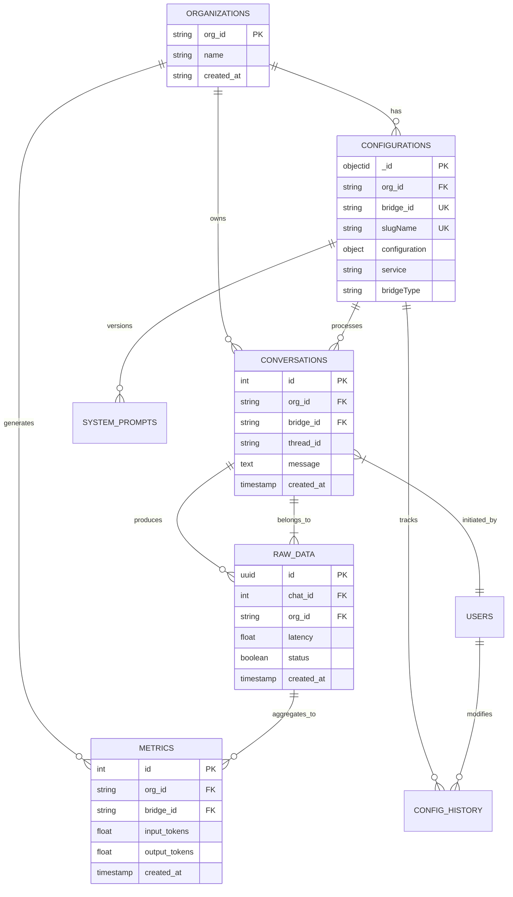

# Database Schema and Relationships

## Overview

The AI Middleware system uses a multi-database architecture with three primary data stores, each optimized for specific use cases:

- **MongoDB**: Document storage for configurations, dynamic data, and collections
- **PostgreSQL**: Relational data for conversations and structured records  
- **TimescaleDB**: Time-series data for metrics and analytics
- **Redis**: Caching and session management

## Database Architecture Diagram

```mermaid
graph TB
    subgraph "Application Layer"
        Services[Application Services]
        Controllers[Controllers]
    end
    
    subgraph "MongoDB Cluster"
        ModelConfigs[(modelconfigurations)]
        Configurations[(configurations)]
        APICallCollection[(apicalls)]
        ChatbotCollection[(chatbots)]
        TemplateCollection[(templates)]
    end
    
    subgraph "PostgreSQL Database"
        Conversations[(conversations)]
        RawData[(raw_data)]
        SystemPrompts[(system_prompt_versionings)]
        ConfigHistory[(user_bridge_config_history)]
    end
    
    subgraph "TimescaleDB"
        MetricsRaw[(metrics_raw_data)]
    end
    
    subgraph "Redis Cache"
        ResponseCache[(Response Cache)]
        SessionData[(Session Data)]
        RateLimitData[(Rate Limit Data)]
    end
    
    %% Relationships
    Services --> ModelConfigs
    Services --> Configurations
    Services --> Conversations
    Services --> RawData
    Services --> MetricsRaw
    Services --> ResponseCache
    
    Conversations ||--o{ RawData : "chat_id"
    SystemPrompts ||--o{ Configurations : "bridge_id"
    ConfigHistory ||--o{ Configurations : "bridge_id"
    
    %% Data Flow
    Controllers --> Services
    Services --> SessionData
    Services --> RateLimitData
```

## Detailed Schema Definitions

### MongoDB Collections

#### Model Configurations Collection
```javascript
// Collection: modelconfigurations
{
  _id: ObjectId,
  service: String,           // AI service provider
  model: String,            // Model identifier
  configuration: Object,    // Model-specific config
  apikey: String,          // Encrypted API key
  org_id: String,          // Organization identifier
  created_at: Date,
  updated_at: Date,
  is_active: Boolean
}

// Indexes
db.modelconfigurations.createIndex({org_id: 1, service: 1})
db.modelconfigurations.createIndex({service: 1, model: 1})
```

#### Configurations Collection
```javascript
// Collection: configurations  
{
  _id: ObjectId,
  org_id: String,           // Organization ID
  service: String,          // AI service provider
  bridgeType: String,       // 'api' | 'chatbot'
  name: String,             // Configuration name
  slugName: String,         // Unique slug
  configuration: Object,    // AI model configuration
  apikey: String,          // API key reference
  api_call: Object,        // API call configuration
  api_endpoints: Array,    // Available endpoints
  is_api_call: Boolean,    // API call flag
  responseIds: Array,      // Response references
  defaultQuestions: Array, // Default questions
  actions: Object,         // Available actions
  created_at: Date,
  updated_at: Date
}

// Unique Index
db.configurations.createIndex({org_id: 1, slugName: 1}, {unique: true})
```

#### Chatbot Collection
```javascript
// Collection: chatbots
{
  _id: ObjectId,
  config: {
    buttonName: String,
    height: String,
    heightUnit: String,
    width: String, 
    widthUnit: String,
    type: String,           // 'popup' | 'embedded'
    themeColor: String
  },
  orgId: String,
  title: String,
  createdBy: String,
  type: String,             // 'chatbot'
  updatedBy: String,
  bridge: Array,            // References to configurations
  created_at: Date,
  updated_at: Date
}
```

### PostgreSQL Tables

#### Conversations Table
```sql
CREATE TABLE conversations (
    id SERIAL PRIMARY KEY,
    org_id VARCHAR,
    thread_id VARCHAR,
    sub_thread_id VARCHAR,
    model_name VARCHAR,
    bridge_id VARCHAR,
    version_id VARCHAR,
    message TEXT,
    message_by VARCHAR,
    function JSON,
    type conversation_type_enum NOT NULL,
    "createdAt" TIMESTAMP DEFAULT NOW(),
    "updatedAt" TIMESTAMP DEFAULT NOW(),
    chatbot_message TEXT,
    is_reset BOOLEAN DEFAULT FALSE,
    tools_call_data JSON[],
    user_feedback INTEGER,
    message_id UUID,
    revised_prompt TEXT,
    image_url TEXT,
    urls VARCHAR[],
    "AiConfig" JSON,
    annotations JSON[]
);

-- Indexes
CREATE INDEX idx_conversations_org_id ON conversations(org_id);
CREATE INDEX idx_conversations_thread_id ON conversations(thread_id);
CREATE INDEX idx_conversations_bridge_id ON conversations(bridge_id);
CREATE INDEX idx_conversations_created_at ON conversations("createdAt");
```

#### Raw Data Table  
```sql
CREATE TABLE raw_data (
    id UUID PRIMARY KEY DEFAULT gen_random_uuid(),
    org_id VARCHAR,
    authkey_name VARCHAR,
    latency FLOAT,
    service VARCHAR,
    status BOOLEAN NOT NULL,
    error TEXT DEFAULT 'none',
    model VARCHAR,
    input_tokens FLOAT,
    output_tokens FLOAT,
    expected_cost FLOAT,
    created_at TIMESTAMP DEFAULT NOW(),
    chat_id INTEGER REFERENCES conversations(id),
    message_id UUID,
    variables JSON,
    is_present BOOLEAN DEFAULT FALSE,
    "firstAttemptError" TEXT
);

-- Indexes
CREATE INDEX idx_raw_data_org_id ON raw_data(org_id);
CREATE INDEX idx_raw_data_chat_id ON raw_data(chat_id);
CREATE INDEX idx_raw_data_created_at ON raw_data(created_at);
CREATE INDEX idx_raw_data_service ON raw_data(service);
```

#### System Prompt Versioning Table
```sql
CREATE TABLE system_prompt_versionings (
    id SERIAL PRIMARY KEY,
    created_at TIMESTAMP NOT NULL DEFAULT NOW(),
    updated_at TIMESTAMP NOT NULL DEFAULT NOW(),
    system_prompt TEXT NOT NULL,
    bridge_id VARCHAR NOT NULL,
    org_id VARCHAR NOT NULL
);

-- Indexes
CREATE INDEX idx_system_prompts_bridge_id ON system_prompt_versionings(bridge_id);
CREATE INDEX idx_system_prompts_org_id ON system_prompt_versionings(org_id);
```

#### User Bridge Config History Table
```sql
CREATE TABLE user_bridge_config_history (
    id SERIAL PRIMARY KEY,
    user_id INTEGER NOT NULL,
    org_id VARCHAR NOT NULL,
    bridge_id VARCHAR NOT NULL,
    type VARCHAR NOT NULL,
    time TIMESTAMP NOT NULL DEFAULT NOW(),
    version_id VARCHAR DEFAULT ''
);

-- Indexes
CREATE INDEX idx_config_history_user_id ON user_bridge_config_history(user_id);
CREATE INDEX idx_config_history_bridge_id ON user_bridge_config_history(bridge_id);
```

### TimescaleDB Hypertables

#### Metrics Raw Data Table
```sql
CREATE TABLE metrics_raw_data (
    id SERIAL PRIMARY KEY,
    org_id VARCHAR,
    bridge_id VARCHAR,
    version_id VARCHAR,
    thread_id VARCHAR,
    model VARCHAR,
    service VARCHAR,
    input_tokens FLOAT,
    output_tokens FLOAT,
    total_tokens FLOAT,
    apikey_id VARCHAR,
    created_at TIMESTAMP DEFAULT NOW(),
    latency FLOAT,
    success BOOLEAN,
    cost FLOAT,
    time_zone VARCHAR
);

-- Convert to hypertable for time-series optimization
SELECT create_hypertable('metrics_raw_data', 'created_at');

-- Indexes for efficient querying
CREATE INDEX idx_metrics_org_id_time ON metrics_raw_data(org_id, created_at);
CREATE INDEX idx_metrics_service_time ON metrics_raw_data(service, created_at);
CREATE INDEX idx_metrics_bridge_id_time ON metrics_raw_data(bridge_id, created_at);
```

### Redis Data Structures

#### Cache Keys Structure
```
# Response Cache
ai_response:{org_id}:{bridge_id}:{hash} -> JSON response
TTL: 3600 seconds (configurable)

# Rate Limiting
rate_limit:{org_id}:{endpoint} -> counter
rate_limit:{thread_id} -> counter
TTL: Based on rate limit window

# Session Data  
session:{user_id} -> user session data
TTL: 86400 seconds (24 hours)

# Configuration Cache
config_cache:{org_id}:{bridge_id} -> configuration JSON
TTL: 1800 seconds (30 minutes)
```

## Entity Relationships

### Primary Relationships



## Data Flow Patterns

### 1. Request Processing Flow
```
Client Request → Authentication → Configuration Lookup (MongoDB) 
→ AI Provider Call → Response Storage (PostgreSQL) 
→ Metrics Recording (TimescaleDB) → Cache Update (Redis)
```

### 2. Analytics Data Flow
```
Raw API Calls (PostgreSQL) → Aggregation Service 
→ Metrics Storage (TimescaleDB) → Dashboard Queries
```

### 3. Configuration Management Flow
```
Configuration Update (MongoDB) → Change Stream Trigger 
→ Cache Invalidation (Redis) → Service Refresh
```

## Performance Optimizations

### Indexing Strategy
- **MongoDB**: Compound indexes on frequently queried fields
- **PostgreSQL**: B-tree indexes on foreign keys and timestamp columns
- **TimescaleDB**: Time-based partitioning with composite indexes
- **Redis**: Key expiration and memory optimization

### Partitioning Strategy
- **TimescaleDB**: Automatic time-based partitioning (1 day chunks)
- **PostgreSQL**: Consider partitioning large tables by org_id or date

### Caching Strategy
- **Application Level**: Redis for frequently accessed data
- **Database Level**: Connection pooling and query optimization
- **CDN Level**: Static content and API response caching

This multi-database architecture provides optimal performance for different data access patterns while maintaining data consistency and enabling horizontal scaling.