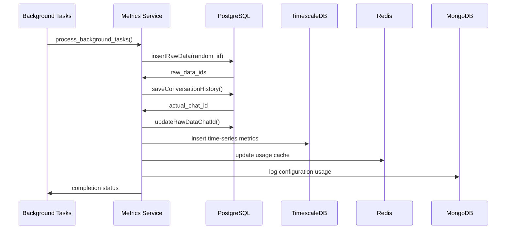

# Database Operations Flow - Metrics & Data Storage

## 🗄️ Database Architecture

### Database Stack:
- **PostgreSQL**: Main data storage and conversation history
- **TimescaleDB**: Time-series metrics and analytics
- **Redis**: Caching layer and session storage
- **MongoDB**: Configuration and bridge data

## 📊 Metrics Collection Flow

### Background Processing
**File**: `src/services/utils/common_utils.py`
**Function**: `process_background_tasks()`

#### Background Operations:
1. **Metrics Creation**: `create()` from metrics_service
2. **Sub-queue Publishing**: Message queue for downstream processing
3. **Conversation Storage**: Thread and message persistence

### Metrics Service
**File**: `src/db_services/metrics_service.py`
**Function**: `create()`

## 🔄 Data Storage Flow (Reordered)

### Step 1: Raw Data Insertion
**Function**: `insertRawData()` in `conversationDbService.py`

#### Process:
```python
def insertRawData(raw_data_list, random_id):
    """
    Insert raw data with temporary chat_id
    Returns: List of inserted record IDs
    """
    inserted_ids = []
    
    for data in raw_data_list:
        # Use random_id as temporary chat_id
        data["chat_id"] = random_id
        
        # Insert into PostgreSQL
        result = db.execute(
            "INSERT INTO raw_data (...) VALUES (...) RETURNING id",
            data
        )
        inserted_ids.append(result.fetchone()[0])
    
    return inserted_ids
```

### Step 2: Conversation History Storage
**Function**: `saveConversationHistory()` in `conversationDbService.py`

#### Process:
```python
def saveConversationHistory(conversation_data):
    """
    Save conversation and get actual chat_id
    Returns: chat_id
    """
    # Insert conversation record
    chat_id = db.execute(
        "INSERT INTO conversations (...) VALUES (...) RETURNING chat_id",
        conversation_data
    ).fetchone()[0]
    
    return chat_id
```

### Step 3: Raw Data Update
**Function**: `updateRawDataChatId()` in `conversationDbService.py`

#### Process:
```python
def updateRawDataChatId(record_ids, actual_chat_id):
    """
    Update raw_data records with actual chat_id
    """
    db.execute(
        "UPDATE raw_data SET chat_id = %s WHERE id = ANY(%s)",
        (actual_chat_id, record_ids)
    )
```

### Complete Reordered Flow:
```python
def create(metrics_data):
    # Generate temporary ID
    random_id = generate_random_id()
    
    # Step 1: Insert raw data with temporary chat_id
    raw_data_ids = insertRawData(metrics_data["raw_data"], random_id)
    
    # Step 2: Save conversation history and get actual chat_id
    actual_chat_id = saveConversationHistory(metrics_data["conversation"])
    
    # Step 3: Update raw_data with actual chat_id
    updateRawDataChatId(raw_data_ids, actual_chat_id)
    
    return {"success": True, "chat_id": actual_chat_id}
```

## 📈 Stored Metrics Data

### Raw Data Table Structure:
```sql
CREATE TABLE raw_data (
    id SERIAL PRIMARY KEY,
    chat_id VARCHAR(255),
    bridge_id VARCHAR(255),
    org_id VARCHAR(255),
    user_input TEXT,
    ai_response TEXT,
    model VARCHAR(100),
    service VARCHAR(100),
    input_tokens INTEGER,
    output_tokens INTEGER,
    total_cost DECIMAL(10,6),
    latency_ms INTEGER,
    created_at TIMESTAMP DEFAULT NOW(),
    updated_at TIMESTAMP DEFAULT NOW()
);
```

### Conversation History Table:
```sql
CREATE TABLE conversations (
    chat_id VARCHAR(255) PRIMARY KEY,
    thread_id VARCHAR(255),
    sub_thread_id VARCHAR(255),
    bridge_id VARCHAR(255),
    org_id VARCHAR(255),
    conversation_data JSONB,
    created_at TIMESTAMP DEFAULT NOW(),
    updated_at TIMESTAMP DEFAULT NOW()
);
```

### TimescaleDB Metrics (Time-Series):
```sql
CREATE TABLE metrics_timeseries (
    time TIMESTAMPTZ NOT NULL,
    bridge_id VARCHAR(255),
    org_id VARCHAR(255),
    service VARCHAR(100),
    model VARCHAR(100),
    input_tokens INTEGER,
    output_tokens INTEGER,
    total_cost DECIMAL(10,6),
    latency_ms INTEGER,
    success_rate DECIMAL(5,2),
    error_count INTEGER
);

-- Create hypertable for time-series optimization
SELECT create_hypertable('metrics_timeseries', 'time');
```

## 🔄 Redis Caching Strategy

### Cache Types:

#### 1. Configuration Cache
```python
# Cache key pattern: config:{bridge_id}:{version_id}
cache_key = f"config:{bridge_id}:{version_id}"
cache_data = {
    "configuration": bridge_config,
    "tools": available_tools,
    "apikeys": service_apikeys,
    "rag_data": document_data,
    "cached_at": datetime.utcnow().isoformat(),
    "ttl": 3600  # 1 hour
}
redis.setex(cache_key, 3600, json.dumps(cache_data))
```

#### 2. Usage Tracking Cache
```python
# Cache key pattern: usage:{bridge_id}:{date}
usage_key = f"usage:{bridge_id}:{date.today()}"
usage_data = {
    "total_requests": 1250,
    "total_tokens": 45000,
    "total_cost": 12.50,
    "last_updated": datetime.utcnow().isoformat()
}
redis.setex(usage_key, 86400, json.dumps(usage_data))  # 24 hours
```

#### 3. Rate Limiting Cache
```python
# Cache key pattern: rate_limit:{bridge_id}:{window}
rate_limit_key = f"rate_limit:{bridge_id}:{window_start}"
rate_data = {
    "count": 95,
    "window_start": window_start.isoformat(),
    "remaining": 5
}
redis.setex(rate_limit_key, window_duration, json.dumps(rate_data))
```

#### 4. GPT Memory Cache
```python
# Cache key pattern: memory:{thread_id}
memory_key = f"memory:{thread_id}"
memory_data = {
    "context": conversation_context,
    "summary": conversation_summary,
    "last_updated": datetime.utcnow().isoformat()
}
redis.setex(memory_key, 7200, json.dumps(memory_data))  # 2 hours
```

## 📊 MongoDB Configuration Storage

### Bridge Configuration:
```javascript
// bridges collection
{
    "_id": ObjectId("..."),
    "bridge_id": "bridge_123",
    "org_id": "org_456", 
    "name": "Customer Support Bot",
    "configuration": {
        "prompt": "You are a helpful assistant...",
        "model": "gpt-4",
        "temperature": 0.7,
        "max_tokens": 1000
    },
    "tools": [...],
    "apikeys": {...},
    "created_at": ISODate("..."),
    "updated_at": ISODate("...")
}
```

### Model Configurations (Optimized):
```javascript
// processed_model_configurations collection
{
    "_id": ObjectId("..."),
    "service": "openai",
    "models": [
        {
            "name": "gpt-4",
            "display_name": "GPT-4",
            "max_tokens": 8192,
            "supports_tools": true,
            "supports_vision": false,
            "cost_per_1k_input": 0.03,
            "cost_per_1k_output": 0.06
        }
    ],
    "last_updated": ISODate("...")
}
```

## 🔍 Query Optimization

### Database Indexes:
```sql
-- PostgreSQL indexes for performance
CREATE INDEX idx_raw_data_bridge_id ON raw_data(bridge_id);
CREATE INDEX idx_raw_data_org_id ON raw_data(org_id);
CREATE INDEX idx_raw_data_created_at ON raw_data(created_at);
CREATE INDEX idx_conversations_thread_id ON conversations(thread_id);

-- TimescaleDB indexes
CREATE INDEX idx_metrics_bridge_id_time ON metrics_timeseries(bridge_id, time DESC);
CREATE INDEX idx_metrics_org_id_time ON metrics_timeseries(org_id, time DESC);
```

### Connection Pooling:
```python
# PostgreSQL connection pool
DATABASE_POOL = {
    "min_connections": 5,
    "max_connections": 20,
    "connection_timeout": 30,
    "idle_timeout": 300
}

# Redis connection pool  
REDIS_POOL = {
    "max_connections": 50,
    "retry_on_timeout": True,
    "socket_timeout": 5
}
```

## 📈 Analytics & Reporting

### Real-time Metrics:
```python
def get_realtime_metrics(bridge_id, timeframe="1h"):
    """Get real-time metrics from TimescaleDB"""
    query = """
    SELECT 
        time_bucket('5m', time) as bucket,
        COUNT(*) as requests,
        AVG(latency_ms) as avg_latency,
        SUM(input_tokens + output_tokens) as total_tokens,
        SUM(total_cost) as total_cost
    FROM metrics_timeseries 
    WHERE bridge_id = %s 
    AND time >= NOW() - INTERVAL %s
    GROUP BY bucket
    ORDER BY bucket DESC
    """
    return execute_query(query, (bridge_id, timeframe))
```

### Usage Analytics:
```python
def get_usage_analytics(org_id, start_date, end_date):
    """Get comprehensive usage analytics"""
    query = """
    SELECT 
        bridge_id,
        service,
        model,
        COUNT(*) as total_requests,
        SUM(input_tokens) as total_input_tokens,
        SUM(output_tokens) as total_output_tokens,
        SUM(total_cost) as total_cost,
        AVG(latency_ms) as avg_latency
    FROM raw_data 
    WHERE org_id = %s 
    AND created_at BETWEEN %s AND %s
    GROUP BY bridge_id, service, model
    ORDER BY total_cost DESC
    """
    return execute_query(query, (org_id, start_date, end_date))
```

## 🚨 Error Handling & Recovery

### Database Resilience:
```python
def execute_with_retry(operation, max_retries=3):
    """Execute database operation with retry logic"""
    for attempt in range(max_retries):
        try:
            return operation()
        except (ConnectionError, TimeoutError) as e:
            if attempt == max_retries - 1:
                raise e
            time.sleep(2 ** attempt)  # Exponential backoff
```

### Data Consistency:
```python
def ensure_data_consistency():
    """Check and fix data consistency issues"""
    # Check for orphaned raw_data records
    orphaned_query = """
    SELECT id FROM raw_data 
    WHERE chat_id NOT IN (SELECT chat_id FROM conversations)
    """
    
    # Fix orphaned records
    fix_query = """
    DELETE FROM raw_data 
    WHERE chat_id NOT IN (SELECT chat_id FROM conversations)
    """
```

## 🔄 Database Flow Summary



This database architecture ensures efficient data storage, retrieval, and analytics while maintaining data consistency and performance optimization.
