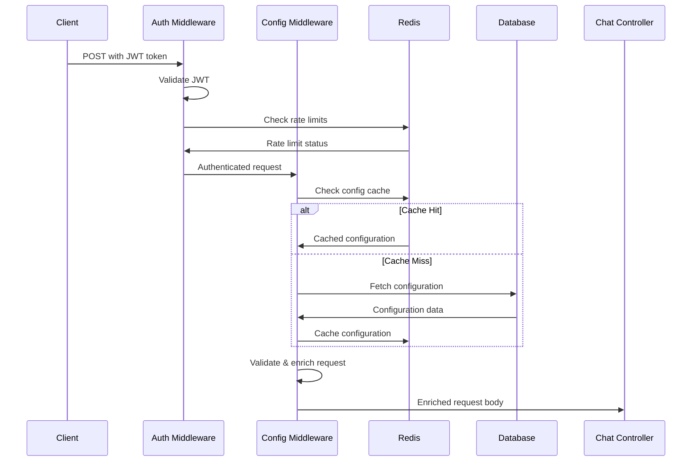

# Middleware Flow - Authentication & Configuration

## 🔐 Authentication & Rate Limiting

### JWT Middleware
**File**: `src/middlewares/auth_and_rate_limit.py`

#### Process Flow:
1. **Token Extraction**: Extract JWT from Authorization header
2. **Token Validation**: Verify token signature and expiration
3. **User Context**: Extract user information and permissions
4. **Rate Limit Check**: Validate request limits per bridge/thread

#### Rate Limiting Rules:
- **Bridge Level**: 100 points per `bridge_id`
- **Thread Level**: 20 points per `thread_id`
- **Time Window**: Configurable sliding window
- **Storage**: Redis-based rate limit tracking

```python
# Rate limit structure
{
    "bridge_id": {
        "count": 95,
        "window_start": "2024-01-01T12:00:00Z",
        "remaining": 5
    },
    "thread_id": {
        "count": 18,
        "window_start": "2024-01-01T12:00:00Z", 
        "remaining": 2
    }
}
```

## ⚙️ Configuration Middleware

### Configuration Enrichment
**File**: `src/middlewares/getDataUsingBridgeId.py`
**Function**: `add_configuration_data_to_body`

#### Step-by-Step Process:

### 1. Request Data Extraction
```python
# Extract key identifiers
bridge_id = request.get("bridge_id")
org_id = request.get("org_id") 
version_id = request.get("version_id")
service = request.get("service")
model = request.get("model")
```

### 2. Configuration Retrieval
**Function**: `getConfiguration()` from `src/services/utils/getConfiguration.py`

#### Input Parameters:
- `configuration`: Base configuration to merge
- `service`: AI service name (openai, anthropic, etc.)
- `bridge_id`: Bridge identifier
- `apikey`: API key for service
- `template_id`: Optional template ID
- `variables`: Variables for prompt replacement
- `org_id`: Organization ID
- `version_id`: Version ID for bridge
- `extra_tools`: Additional tools to include

#### Database Operations:
**File**: `src/db_services/ConfigurationServices.py`
**Function**: `get_bridges_with_tools_and_apikeys`

```python
# MongoDB Aggregation Pipeline
[
    {"$match": {"_id": ObjectId(bridge_id)}},
    {"$lookup": {
        "from": "apicalls",
        "localField": "_id", 
        "foreignField": "bridge_id",
        "as": "tools"
    }},
    {"$lookup": {
        "from": "apikeycredentials",
        "localField": "org_id",
        "foreignField": "org_id", 
        "as": "apikeys"
    }},
    {"$lookup": {
        "from": "rag_parent_datas",
        "localField": "_id",
        "foreignField": "bridge_id",
        "as": "rag_data"
    }}
]
```

### 3. Configuration Assembly

#### Core Configuration:
- **prompt**: System prompt with tone and response style
- **model**: AI model to use
- **tools**: Available function tools
- **tool_choice**: Tool selection strategy
- **temperature**, **max_tokens**: Model parameters

#### Metadata:
- **service**: AI service provider
- **apikey**: Service API key
- **bridge_id**: Bridge identifier
- **org_id**: Organization ID
- **variables**: Prompt variables
- **rag_data**: Document data for RAG
- **gpt_memory**: Memory settings
- **tool_call_count**: Maximum tool calls allowed

### 4. Validation Checks

#### Required Field Validation:
- `user` message (mandatory unless images provided)
- Valid `service` and `model` combination
- Valid `bridge_id` or `agent_id`
- Organization permissions for custom models

#### Model/Service Compatibility:
```python
# Service-specific model validation
service_models = {
    "openai": ["gpt-4", "gpt-3.5-turbo", "gpt-4-turbo"],
    "anthropic": ["claude-3-opus", "claude-3-sonnet"],
    "gemini": ["gemini-pro", "gemini-pro-vision"],
    "groq": ["llama2-70b-4096", "mixtral-8x7b-32768"]
}
```

### 5. Redis Caching

#### Cache Strategy:
- **Key Pattern**: `config:{bridge_id}:{version_id}`
- **TTL**: 1 hour for active configurations
- **Invalidation**: On configuration updates

```python
# Cache structure
{
    "configuration": {...},
    "tools": [...],
    "apikeys": {...},
    "rag_data": [...],
    "cached_at": "2024-01-01T12:00:00Z",
    "ttl": 3600
}
```

## 🚨 Error Handling

### Validation Errors:
- **401 Unauthorized**: Invalid or expired JWT token
- **403 Forbidden**: Organization permission violations
- **429 Too Many Requests**: Rate limit exceeded
- **400 Bad Request**: Missing required fields or invalid model/service combinations

### Processing Errors:
- **500 Internal Server Error**: Database connection failures
- **502 Bad Gateway**: External service unavailability
- **504 Gateway Timeout**: Configuration retrieval timeout

### Error Response Format:
```json
{
    "success": false,
    "error": "Error description",
    "error_code": "RATE_LIMIT_EXCEEDED",
    "details": {
        "bridge_id": "bridge_123",
        "current_usage": 100,
        "limit": 100,
        "reset_time": "2024-01-01T13:00:00Z"
    }
}
```

## 🔄 Flow Summary



This middleware layer ensures secure, validated, and properly configured requests reach the chat controller with all necessary context and permissions.
