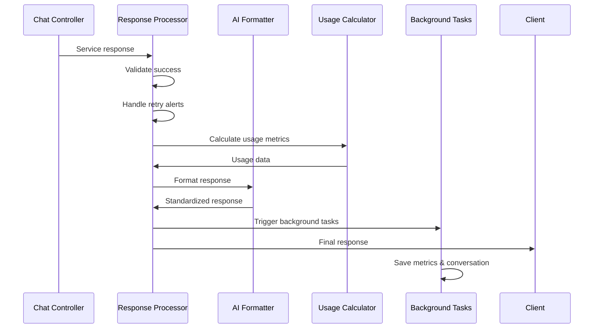

# Response Formatting Flow - Processing & Delivery

## 📤 Response Processing Pipeline

### Main Response Handler
**File**: `src/services/commonServices/common.py`
**Function**: `chat()` (post-execution processing)

## 🔄 Post-Execution Processing Flow

### 1. Success Validation
```python
def validate_service_response(service_response):
    """Validate AI service execution success"""
    if not service_response.get("success", False):
        return handle_service_error(service_response)
    
    return service_response
```

### 2. Retry Alert Handling
```python
def handle_retry_alerts(service_response, original_model):
    """Handle fallback model notifications"""
    if service_response.get("model_used") != original_model:
        alert_data = {
            "type": "model_fallback",
            "original_model": original_model,
            "fallback_model": service_response.get("model_used"),
            "reason": service_response.get("fallback_reason")
        }
        send_webhook_notification(alert_data)
    
    return service_response
```

### 3. Chatbot Response Processing
```python
def process_chatbot_response(response, is_chatbot=False):
    """Special handling for chatbot responses"""
    if is_chatbot:
        # Apply chatbot-specific formatting
        response = format_chatbot_response(response)
        
        # Add chatbot metadata
        response["chatbot_metadata"] = {
            "response_type": "chatbot",
            "formatted_at": datetime.utcnow().isoformat()
        }
    
    return response
```

### 4. Usage Calculation
**File**: `src/services/utils/token_calculator.py`

#### Token & Cost Calculation:
```python
def calculate_usage_metrics(response, model_config):
    """Calculate comprehensive usage metrics"""
    
    # Extract token counts
    input_tokens = response.get("usage", {}).get("input_tokens", 0)
    output_tokens = response.get("usage", {}).get("output_tokens", 0)
    
    # Calculate costs based on model pricing
    input_cost = (input_tokens / 1000) * model_config.get("input_cost_per_1k", 0)
    output_cost = (output_tokens / 1000) * model_config.get("output_cost_per_1k", 0)
    total_cost = input_cost + output_cost
    
    return {
        "input_tokens": input_tokens,
        "output_tokens": output_tokens,
        "total_tokens": input_tokens + output_tokens,
        "input_cost": round(input_cost, 6),
        "output_cost": round(output_cost, 6),
        "total_cost": round(total_cost, 6),
        "model": model_config.get("name"),
        "service": model_config.get("service")
    }
```

## 📋 Response Format Standardization

### AI Middleware Format
**File**: `src/services/utils/ai_middleware_format.py`

#### Standard Response Structure:
```python
def format_ai_response(service_response, usage_metrics):
    """Convert service response to standard AI middleware format"""
    
    formatted_response = {
        "success": True,
        "output": [],
        "usage": usage_metrics,
        "metadata": {
            "service": service_response.get("service"),
            "model": service_response.get("model"),
            "processing_time_ms": service_response.get("latency_ms"),
            "timestamp": datetime.utcnow().isoformat()
        }
    }
    
    # Process output content
    for item in service_response.get("output", []):
        formatted_item = format_output_item(item)
        formatted_response["output"].append(formatted_item)
    
    return formatted_response
```

#### Output Item Formatting:
```python
def format_output_item(item):
    """Format individual output items"""
    
    # Handle different content types
    if item.get("type") == "function_call":
        return format_function_call_item(item)
    elif item.get("type") == "text":
        return format_text_item(item)
    elif item.get("type") == "image":
        return format_image_item(item)
    else:
        return format_generic_item(item)

def format_text_item(item):
    """Format text content item"""
    return {
        "type": "text",
        "content": {
            "text": extract_text_content(item)
        },
        "metadata": {
            "content_type": "text/plain",
            "length": len(extract_text_content(item))
        }
    }

def format_function_call_item(item):
    """Format function call item"""
    return {
        "type": "function_call",
        "content": {
            "name": item.get("name"),
            "arguments": item.get("arguments", {}),
            "result": item.get("result")
        },
        "metadata": {
            "execution_time_ms": item.get("execution_time_ms"),
            "success": item.get("success", True)
        }
    }
```

## 🎯 Response Type Handling

### Default Response Format
```python
def handle_default_response(formatted_response):
    """Handle default synchronous response"""
    return {
        "success": True,
        "data": formatted_response,
        "response_type": "default"
    }
```

### Queue-Based Response Processing
```python
def handle_queue_response(request_data, response_format):
    """Handle non-default response formats via queue"""
    
    if response_format.get("type") != "default":
        # Publish to queue for async processing
        queue_message = {
            "request_id": generate_request_id(),
            "request_data": request_data,
            "response_format": response_format,
            "timestamp": datetime.utcnow().isoformat()
        }
        
        publish_to_queue("response_processing", queue_message)
        
        return {
            "success": True,
            "message": "Request queued for processing",
            "request_id": queue_message["request_id"],
            "response_type": "queued"
        }
```

### Webhook Response Delivery
```python
def deliver_webhook_response(response_data, webhook_config):
    """Deliver response via webhook"""
    
    webhook_payload = {
        "event": "chat_completion",
        "data": response_data,
        "timestamp": datetime.utcnow().isoformat(),
        "signature": generate_webhook_signature(response_data)
    }
    
    try:
        webhook_response = requests.post(
            webhook_config["url"],
            json=webhook_payload,
            headers={
                "Content-Type": "application/json",
                "X-Webhook-Signature": webhook_payload["signature"]
            },
            timeout=30
        )
        
        return {
            "success": webhook_response.status_code == 200,
            "status_code": webhook_response.status_code,
            "delivery_time_ms": webhook_response.elapsed.total_seconds() * 1000
        }
        
    except Exception as e:
        return {
            "success": False,
            "error": str(e),
            "retry_scheduled": True
        }
```

## 📱 Playground vs Production Mode

### Playground Mode Response
```python
def format_playground_response(response_data):
    """Format response for playground environment"""
    
    playground_response = {
        "success": True,
        "output": response_data.get("output", []),
        "usage": response_data.get("usage", {}),
        "debug_info": {
            "processing_steps": response_data.get("debug_steps", []),
            "model_config": response_data.get("model_config", {}),
            "execution_time": response_data.get("execution_time_ms", 0)
        },
        "metadata": response_data.get("metadata", {})
    }
    
    return playground_response
```

### Production Mode Response
```python
def format_production_response(response_data, delivery_config):
    """Format response for production environment"""
    
    production_response = {
        "success": True,
        "output": response_data.get("output", []),
        "usage": response_data.get("usage", {}),
        "metadata": {
            "service": response_data.get("metadata", {}).get("service"),
            "model": response_data.get("metadata", {}).get("model"),
            "timestamp": datetime.utcnow().isoformat()
        }
    }
    
    # Remove debug information for production
    if "debug_info" in production_response:
        del production_response["debug_info"]
    
    return production_response
```

## 🔄 Background Task Integration

### Background Processing Trigger
```python
def trigger_background_processing(response_data, request_context):
    """Trigger background tasks after response formatting"""
    
    background_tasks = [
        save_conversation_history,
        update_usage_metrics,
        send_analytics_data,
        cache_response_data
    ]
    
    for task in background_tasks:
        asyncio.create_task(
            task(response_data, request_context)
        )
```

### Async Background Operations
```python
async def save_conversation_history(response_data, context):
    """Save conversation to database"""
    conversation_data = {
        "thread_id": context.get("thread_id"),
        "user_message": context.get("user_input"),
        "ai_response": response_data.get("output", []),
        "metadata": response_data.get("metadata", {})
    }
    
    await database.save_conversation(conversation_data)

async def update_usage_metrics(response_data, context):
    """Update usage metrics in TimescaleDB"""
    metrics_data = {
        "bridge_id": context.get("bridge_id"),
        "org_id": context.get("org_id"),
        "usage": response_data.get("usage", {}),
        "timestamp": datetime.utcnow()
    }
    
    await timescale_db.insert_metrics(metrics_data)
```

## 🚨 Error Response Formatting

### Error Response Structure
```python
def format_error_response(error, context=None):
    """Format error responses consistently"""
    
    error_response = {
        "success": False,
        "error": {
            "type": error.get("type", "unknown_error"),
            "message": error.get("message", "An error occurred"),
            "code": error.get("code", "INTERNAL_ERROR")
        },
        "metadata": {
            "timestamp": datetime.utcnow().isoformat(),
            "request_id": context.get("request_id") if context else None
        }
    }
    
    # Add debug info in development
    if os.getenv("ENVIRONMENT") == "development":
        error_response["debug"] = {
            "stack_trace": error.get("stack_trace"),
            "context": context
        }
    
    return error_response
```

### Service-Specific Error Handling
```python
def handle_service_errors(service_error, service_name):
    """Handle service-specific errors"""
    
    error_mappings = {
        "openai": handle_openai_errors,
        "anthropic": handle_anthropic_errors,
        "gemini": handle_gemini_errors
    }
    
    handler = error_mappings.get(service_name, handle_generic_error)
    return handler(service_error)

def handle_openai_errors(error):
    """Handle OpenAI-specific errors"""
    if "rate_limit" in str(error).lower():
        return {
            "type": "rate_limit_exceeded",
            "message": "OpenAI rate limit exceeded",
            "code": "OPENAI_RATE_LIMIT",
            "retry_after": extract_retry_after(error)
        }
    elif "insufficient_quota" in str(error).lower():
        return {
            "type": "quota_exceeded", 
            "message": "OpenAI quota exceeded",
            "code": "OPENAI_QUOTA_EXCEEDED"
        }
    else:
        return {
            "type": "service_error",
            "message": str(error),
            "code": "OPENAI_ERROR"
        }
```

## 📊 Response Metrics & Analytics

### Response Analytics Collection
```python
def collect_response_analytics(response_data, request_context):
    """Collect analytics data for response"""
    
    analytics_data = {
        "response_size_bytes": len(json.dumps(response_data)),
        "output_items_count": len(response_data.get("output", [])),
        "processing_time_ms": response_data.get("metadata", {}).get("processing_time_ms"),
        "success_rate": 1 if response_data.get("success") else 0,
        "model_used": response_data.get("metadata", {}).get("model"),
        "service_used": response_data.get("metadata", {}).get("service")
    }
    
    # Send to analytics service
    send_analytics_event("response_processed", analytics_data)
```

## 🔄 Response Flow Summary



This response formatting system ensures consistent, well-structured responses across all AI services while providing comprehensive error handling and analytics collection.
