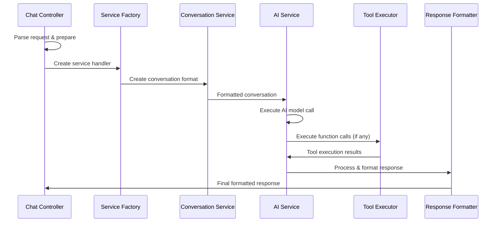

# Service Layer Flow - AI Service Selection & Execution

## 🎯 Chat Controller Processing

### Main Chat Function
**File**: `src/services/commonServices/common.py`
**Function**: `chat(request_body)`

### Step-by-Step Processing:

#### 1. Request Parsing (`parse_request_body`)
```python
# Extract and structure request data
parsed_data = {
    "bridge_id": request.get("bridge_id"),
    "configuration": request.get("configuration"),
    "thread_id": request.get("thread_id"),
    "sub_thread_id": request.get("sub_thread_id"),
    "org_id": request.get("org_id"),
    "user": request.get("user"),
    "service": request.get("service"),
    "model": request.get("model"),
    "variables": request.get("variables", {}),
    "tools": request.get("tools", []),
    "is_playground": request.get("is_playground", False),
    "response_format": request.get("response_format", {"type": "default"}),
    "files": request.get("files", []),
    "images": request.get("images", [])
}
```

#### 2. Template Enhancement
- Adds default template with current time reference
- Adds user message to variables as `_user_message`
- Processes system templates if specified

#### 3. Performance Tracking
```python
# Timer initialization for performance monitoring
timer = Timer()
timer.start("overall_execution")
```

#### 4. Model Configuration Loading
- Loads model configuration from `model_config_document`
- Extracts custom configuration based on user input
- Handles fine-tuned model selection

#### 5. Pre-Tools Execution
- Executes pre-configured tools if specified
- Makes HTTP calls to external functions
- Stores results in variables for prompt injection

#### 6. Thread Management
- Creates or retrieves conversation thread
- Manages sub-thread relationships  
- Loads conversation history for context

#### 7. Prompt Preparation
- Replaces variables in prompt template
- Applies system templates if specified
- Handles memory context for GPT memory
- Identifies missing required variables

#### 8. Custom Settings Configuration
- Applies service-specific configurations
- Handles response type conversions
- Manages JSON schema formatting

## 🤖 Service Handler Factory

### Service Creation
**File**: `src/services/utils/helper.py`
**Function**: `Helper.create_service_handler`

### Service Mapping:
```python
SERVICE_HANDLERS = {
    "openai": "UnifiedOpenAICase",
    "gemini": "GeminiHandler", 
    "anthropic": "Antrophic",
    "groq": "Groq",
    "openai_response": "OpenaiResponse",
    "open_router": "OpenRouter",
    "mistral": "Mistral"
}
```

### Service Parameter Building:
```python
service_params = {
    "customConfig": custom_config,
    "configuration": full_configuration,
    "apikey": service_api_key,
    "user": user_message,
    "tools": available_tools,
    "org_id": organization_id,
    "bridge_id": bridge_identifier,
    "thread_id": thread_identifier,
    "model": model_name,
    "service": service_name,
    "token_calculator": cost_tracking_object,
    "variables": prompt_variables,
    "memory": memory_context,
    "rag_data": document_data
}
```

## 🔄 Service Execution Flow

### OpenAI Service Example
**File**: `src/services/commonServices/openAI/openaiCall.py`
**Class**: `UnifiedOpenAICase`

#### Execution Steps:

### 1. Conversation Creation
**File**: `src/services/commonServices/createConversations.py`
**Function**: `ConversationService.createOpenAiConversation`

#### Conversation Processing:
- Adds memory context if GPT memory is enabled
- Processes conversation history with role-based formatting
- Handles image URLs and file attachments
- Creates proper message structure for OpenAI API

```python
# OpenAI conversation format
conversation = [
    {
        "role": "system",
        "content": system_prompt
    },
    {
        "role": "user", 
        "content": user_message,
        "images": image_urls  # if applicable
    }
]
```

### 2. Service-Specific Conversation Formats:

#### OpenAI Standard:
```python
def createOpenAiConversation(history, memory_context):
    # Standard OpenAI chat completion format
    return formatted_messages
```

#### OpenAI Response API:
```python
def createOpenAiResponseConversation(history, memory_context):
    # OpenAI Response API specific format
    return formatted_messages
```

#### Anthropic Claude:
```python
def createAnthropicConversation(history, memory_context):
    # Claude-specific message format
    return formatted_messages
```

#### Google Gemini:
```python
def createGeminiConversation(history, memory_context):
    # Gemini-specific format with parts structure
    return formatted_messages
```

### 3. Model API Call Routing
**File**: `src/services/commonServices/baseService/baseService.py`
**Function**: `self.chats()`

#### Service Routing Logic:
```python
def route_to_service(service_name):
    routing_map = {
        "openai": "runModel",
        "openai_response": "openai_response_model", 
        "anthropic": "anthropic_runmodel",
        "groq": "groq_runmodel",
        "gemini": "gemini_modelrun",
        "mistral": "mistral_model_run",
        "open_router": "openrouter_modelrun"
    }
    return routing_map.get(service_name)
```

### 4. OpenAI Model Execution
**File**: `src/services/commonServices/openAI/runModel.py`
**Function**: `runModel`

#### Key Features:
- Async OpenAI client initialization
- Retry mechanism with alternative model fallback
- Streaming response handling
- Token usage tracking
- Error handling and logging

```python
async def runModel(params):
    client = AsyncOpenAI(api_key=params["apikey"])
    
    try:
        response = await client.chat.completions.create(
            model=params["model"],
            messages=params["conversation"],
            tools=params["tools"],
            temperature=params.get("temperature", 0.7),
            max_tokens=params.get("max_tokens", 1000)
        )
        return process_response(response)
    except Exception as e:
        return handle_fallback(e, params)
```

## 🔧 Tool Processing

### Function Call Detection
**File**: `src/services/commonServices/openAI/openai_response.py`

#### Enhanced Detection Strategy:
```python
def detect_function_calls(response):
    # Check multiple response formats
    detection_methods = [
        check_tool_calls,
        check_function_call,
        check_embedded_calls,
        check_reasoning_calls
    ]
    
    for method in detection_methods:
        if method(response):
            return True
    return False
```

### Tool Execution
**File**: `src/services/commonServices/baseService/baseService.py`
**Function**: `execute_tools_concurrently`

#### Concurrent Tool Processing:
```python
async def execute_tools_concurrently(tool_calls):
    tasks = []
    for tool_call in tool_calls:
        task = asyncio.create_task(
            execute_single_tool(tool_call)
        )
        tasks.append(task)
    
    results = await asyncio.gather(*tasks, return_exceptions=True)
    return process_tool_results(results)
```

### Tool Result Integration
**Function**: `update_model_response` in `baseService.py`

#### OpenAI Response Integration:
```python
def update_model_response(original_response, tool_results, service):
    if service == "openai_response":
        # Merge tool results into original response
        merged_output = merge_function_call_results(
            original_response.get("output", []),
            tool_results
        )
        
        # Combine usage tokens
        combined_usage = combine_usage_tokens(
            original_response.get("usage", {}),
            tool_results.get("usage", {})
        )
        
        return {
            "output": merged_output,
            "usage": combined_usage
        }
```

## 📊 Response Processing

### Content Extraction
**File**: `src/services/utils/ai_middleware_format.py`

#### Function Call Content:
```python
def extract_function_call_content(call):
    # Extract function name and arguments
    name = call.get("name", "unknown_function")
    arguments = call.get("arguments", {})
    
    return f"Function call: {name} with arguments: {arguments}"
```

#### Fallback Content Mechanism:
```python
def extract_content_with_fallback(item):
    # Try multiple content sources
    content_sources = [
        lambda: item.get("content", {}).get("text"),
        lambda: item.get("message"),
        lambda: item.get("output_text"),
        lambda: item.get("reasoning")
    ]
    
    for source in content_sources:
        content = source()
        if content:
            return content
    
    return "No content available"
```

## 🔄 Service Flow Summary



## 🚨 Error Handling & Fallbacks

### Model Fallback Strategy:
```python
FALLBACK_MODELS = {
    "gpt-4": ["gpt-4-turbo", "gpt-3.5-turbo"],
    "claude-3-opus": ["claude-3-sonnet", "claude-3-haiku"],
    "gemini-pro": ["gemini-pro-vision"]
}
```

### Retry Mechanism:
- **Max Retries**: 3 attempts per request
- **Backoff Strategy**: Exponential backoff
- **Fallback Models**: Automatic alternative model selection
- **Error Logging**: Comprehensive error tracking

This service layer ensures robust AI service execution with comprehensive error handling, tool processing, and response formatting capabilities.
